# Thuật toán & Pattern quan trọng — Trạng thái hiện tại & Kế hoạch

> Last reviewed: 2026-08-11 — verified against `src/modules/matching/`, `src/modules/orders/`, `src/modules/wallets/`, `src/modules/treasury/`, `src/common/`, `src/modules/trading/`, `go-services/`, `fe-cryptocurrency-trading-app/lib/core/services/`.
>
> **Verification 2026-08-11**: Đã xác minh tất cả các file và thư mục được reference trong tài liệu tồn tại trong codebase. Các implementation đã được verify:
> - ✅ Price-Time Priority (TS): `src/modules/matching/domain/services/strategies/price-time-priority.strategy.ts`
> - ✅ Price-Time Priority (Go): `go-services/matching-engine/internal/domain/matching/strategy.go`
> - ✅ Market Order Strategy: `src/modules/matching/domain/services/strategies/market-order.strategy.ts`
> - ✅ Order Book: `src/modules/matching/domain/services/orderbook/order-book.service.ts`
> - ✅ Circuit Breaker: `src/modules/matching/domain/services/circuit-breaker.service.ts`
> - ✅ Trading Price Stream: `src/modules/trading/services/trading-price-stream.service.ts`
> - ✅ Binance Price Feed: `src/modules/trading/services/binance-price-feed.service.ts`
> - ✅ Redis Distributed Lock: `src/common/utils/redis-distributed-lock.ts`
> - ✅ Binance REST Client: `src/modules/binance-rest/binance-rest-client.service.ts`
> - ✅ Event Store: `src/modules/matching/infrastructure/projections/event-store.ts`
> - ✅ Technical Indicators (Flutter): `fe-cryptocurrency-trading-app/lib/core/services/indicator_service.dart`
> - ✅ Chart Cache (Flutter): `fe-cryptocurrency-trading-app/lib/core/services/chart_cache_service.dart`

Tài liệu này audit **6 nhóm thuật toán/pattern quan trọng** của một sàn giao dịch tiền mã hoá và map chúng sang codebase hiện tại (NestJS backend + Go services + Flutter frontend). Mỗi mục có:

- **Trạng thái**: ✅ đã có | 🟡 có một phần | ❌ chưa có
- **Code pointer**: đường dẫn file + dòng chính yếu
- **Logic hiện tại**: nó chạy như thế nào, đảm bảo invariant gì
- **Kế hoạch** (nếu thiếu): cách implement khi `ONCHAIN_OPERATOR_MODE=sandbox` (logic-only, không phụ thuộc mainnet)

> **Phạm vi ưu tiên**: vì biến `ONCHAIN_OPERATOR_MODE=sandbox` (xem `.env.development` dòng 85), tất cả thuật toán liên quan on-chain (Saga, deposit/withdrawal compensation, on-chain price feed…) đều dùng testnet, nên có thể implement logic-only mà không cần gas/mainnet secrets. Các thuật toán pure backend (matching, locking, idempotency, HMAC, rate-limit) chạy như nhau ở mọi mode.

---

## Tóm tắt nhanh

| # | Nhóm | Mục con | Trạng thái | Ghi chú |
|---|------|---------|-----------|---------|
| 1 | Order Matching & Order Book | Price-Time Priority (FIFO) | ✅ | TS + Go đều có |
| 1 | | Order Book data structure | 🟡 | TS dùng sorted Array (O(n) insert), Go dùng Binary Heap |
| 1 | | Self-Trade Prevention (STP) | ✅ | TS + Go |
| 1 | | Circuit Breaker per pair | ✅ | TS |
| 2 | Real-time data | WebSocket streaming | ✅ | Socket.IO + Redis pub/sub |
| 2 | | OHLC aggregation (sliding window) | ✅ | `TradingPriceStreamService.aggregateCandle` |
| 2 | | Circular buffer / ring buffer cho tick | 🟡 | `ChartCacheService` cap cứng, không ring buffer thực thụ |
| 2 | | Delta compression (depth diff) | ❌ | Chưa có |
| 3 | Technical Analysis | SMA / EMA | ✅ | Flutter `IndicatorService` |
| 3 | | RSI | ✅ | Flutter |
| 3 | | MACD | ✅ | Flutter |
| 3 | | Bollinger Bands | ✅ | Flutter |
| 3 | | Kalman Filter / Exponential Smoothing | ❌ | Chưa có |
| 3 | | Incremental (streaming) recompute | ❌ | Hiện compute lại toàn bộ mỗi tick |
| 4 | Risk & Execution | Position sizing (Kelly / Fixed Fractional) | 🟡 | MarketMaker có spread Bps, chưa có Kelly/Fixed Fractional cổ điển |
| 4 | | Slippage estimation | ✅ | `MarketOrderStrategy.slippageTolerance` + `TradingPriceValidatorService` |
| 4 | | Idempotency key + distributed lock | ✅ | Redis SET NX EX + Lua release + `withDistributedLock` |
| 5 | Consistency & Concurrency | Optimistic/Pessimistic Locking cho balance | ✅ | `SELECT … FOR UPDATE` ở MySQL store procedures + Redis Lua cho matching |
| 5 | | Event Sourcing + CQRS | ✅ | `integration_outbox` + `OrderBookEvent` event store + ApplicationBus CQRS |
| 5 | | Saga Pattern (compensating tx) | ❌ | Chưa có |
| 6 | Security | HMAC signature cho API sàn (Binance/OKX) | ✅ | `BinanceRestClient.signedRequest` dùng `createHmac('sha256')` |
| 6 | | Rate limiting (Token Bucket / Sliding Window Counter) | 🟡 | Log-throttle (60s window), chưa có token bucket thực thụ cho outbound API sàn |

---

## 1. Order Matching & Order Book

### 1.1 Price-Time Priority (FIFO) — ✅

**Code**:

- TS: `be-cryptocurrency-trading-app/src/modules/matching/domain/services/strategies/price-time-priority.strategy.ts`
- TS market variant: `be-cryptocurrency-trading-app/src/modules/matching/domain/services/strategies/market-order.strategy.ts`
- Go: `be-cryptocurrency-trading-app/go-services/matching-engine/internal/domain/matching/strategy.go`

**Logic hiện tại (TS)**:

```79:103:be-cryptocurrency-trading-app/src/modules/matching/domain/services/strategies/price-time-priority.strategy.ts
  async match(
    context: MatchingContext,
    orderBook: {
      peekBestMaker: (pairId: string, side: 'BUY' | 'SELL') => OrderBookOrder | null;
      popBestMaker: (pairId: string, side: 'BUY' | 'SELL') => OrderBookOrder | null;
      addOrder: (order: OrderBookOrder) => void;
    },
    executeTrade: TradeExecutor,
  ): Promise<TradeExecutionResult[]> {
    const { pairId, takerOrder } = context;
    const oppositeSide = takerOrder.side === 'BUY' ? 'SELL' : 'BUY';
```

Loop trong khi `takerRemaining > 0`:

1. `peekBestMaker` lấy best price từ side đối diện (BuyQueue DESC, SellQueue ASC).
2. **Self-Trade Prevention (STP)**: nếu `maker.user_id === taker.user_id` → skip, log warning. (line 56-63)
3. **Price-cross check**: BUY taker khớp khi `maker.price ≤ taker.price`; SELL taker khớp khi `maker.price ≥ taker.price`.
4. `fillAmount = min(takerRemaining, makerRemaining)`.
5. `popBestMaker` + `executeTrade` → nếu DB từ chối → restore maker + break.
6. Phần maker còn lại (`makerRemaining > 0`) → `addOrder` lại với `filled_amount` cập nhật.
7. Taker còn dư + GTC → `addOrder` vào book để rest; IOC/FOK → cancel remainder qua `matchingRepository.cancelIocRemainder`.

**BigInt để tránh float**: tất cả price/amount đi qua `toBaseUnits(...)` (DECIMAL(36,18) → int64). Mọi phép nhân/chia đều `BigInt` để deterministic.

**Logic hiện tại (Go)** — `strategy.go`:

- Tách 3 nhánh `matchGTC`/`matchIOC`/`matchFOK`.
- Slippage check với `slippageToleranceBps` (basis points, ví dụ 50 = 0.5%).
- STP: `if maker.UserID == taker.UserID { book.RemoveOrder(...); continue }` (line 127-131).
- Sau loop, tạo `Trade` qua `domain.NewTrade(...)` rồi `f.maker.Fill(f.amount)` cập nhật `FilledAmount`.

**Time priority**: cùng giá thì sort theo `createdAt ASC` (xem `OrderQueueService.sort` TS và `BuyOrderLess`/`SellOrderLess` Go).

**Class diagram**:

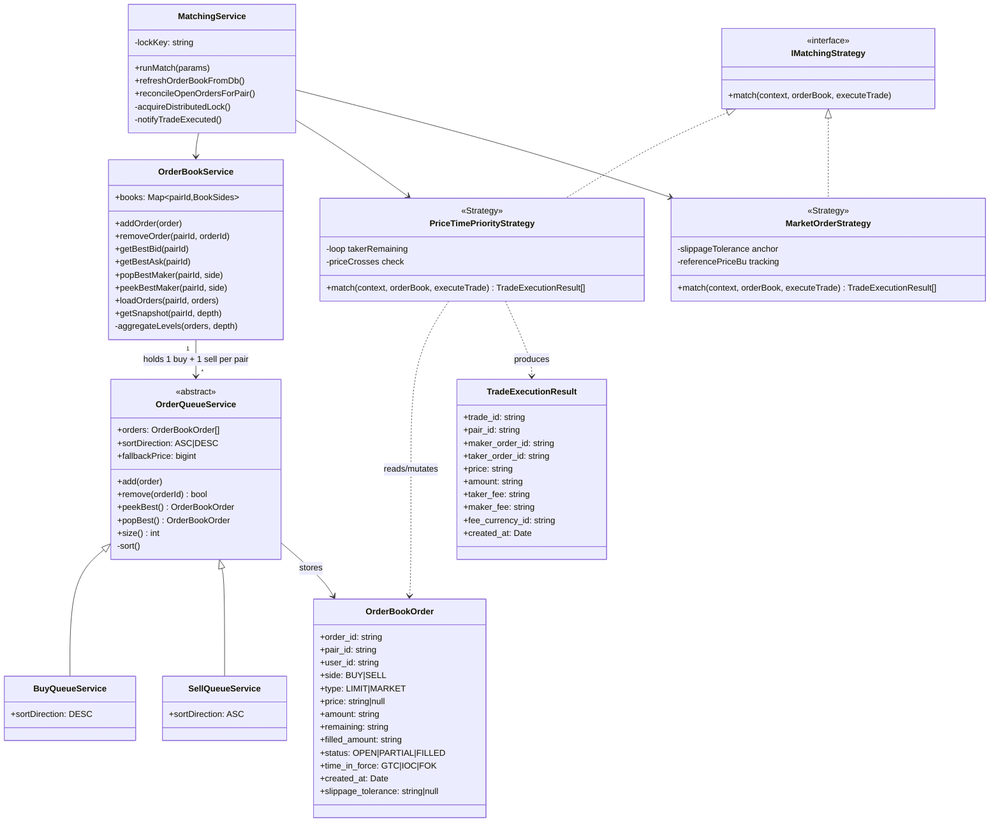
```mermaid
classDiagram
    class MatchingService {
        +runMatch(params)
        +refreshOrderBookFromDb()
        +reconcileOpenOrdersForPair()
        -lockKey: string
        -acquireDistributedLock()
        -notifyTradeExecuted()
    }

    class OrderBookService {
        +books: Map~pairId,BookSides~
        +addOrder(order)
        +removeOrder(pairId, orderId)
        +getBestBid(pairId)
        +getBestAsk(pairId)
        +popBestMaker(pairId, side)
        +peekBestMaker(pairId, side)
        +loadOrders(pairId, orders)
        +getSnapshot(pairId, depth)
        -aggregateLevels(orders, depth)
    }

    class OrderQueueService {
        <<abstract>>
        +orders: OrderBookOrder[]
        +sortDirection: ASC|DESC
        +fallbackPrice: bigint
        +add(order)
        +remove(orderId) bool
        +peekBest() OrderBookOrder
        +popBest() OrderBookOrder
        +size() int
        -sort()
    }

    class BuyQueueService {
        +sortDirection: DESC
    }

    class SellQueueService {
        +sortDirection: ASC
    }

    class PriceTimePriorityStrategy {
        <<Strategy>>
        +match(context, orderBook, executeTrade) TradeExecutionResult[]
        -loop takerRemaining
        -priceCrosses check
    }

    class MarketOrderStrategy {
        <<Strategy>>
        +match(context, orderBook, executeTrade) TradeExecutionResult[]
        -slippageTolerance anchor
        -referencePriceBu tracking
    }

    class IMatchingStrategy {
        <<interface>>
        +match(context, orderBook, executeTrade)
    }

    class OrderBookOrder {
        +order_id: string
        +pair_id: string
        +user_id: string
        +side: BUY|SELL
        +type: LIMIT|MARKET
        +price: string|null
        +amount: string
        +remaining: string
        +filled_amount: string
        +status: OPEN|PARTIAL|FILLED
        +time_in_force: GTC|IOC|FOK
        +created_at: Date
        +slippage_tolerance: string|null
    }

    class TradeExecutionResult {
        +trade_id: string
        +pair_id: string
        +maker_order_id: string
        +taker_order_id: string
        +price: string
        +amount: string
        +taker_fee: string
        +maker_fee: string
        +fee_currency_id: string
        +created_at: Date
    }

    OrderBookService "1" --> "*" OrderQueueService : holds 1 buy + 1 sell per pair
    OrderQueueService <|-- BuyQueueService
    OrderQueueService <|-- SellQueueService
    OrderQueueService --> OrderBookOrder : stores
    IMatchingStrategy <|.. PriceTimePriorityStrategy
    IMatchingStrategy <|.. MarketOrderStrategy
    MatchingService --> OrderBookService
    MatchingService --> PriceTimePriorityStrategy
    MatchingService --> MarketOrderStrategy
    PriceTimePriorityStrategy ..> OrderBookOrder : reads/mutates
    PriceTimePriorityStrategy ..> TradeExecutionResult : produces
```

**Sequence diagram — Price-Time Priority match**:

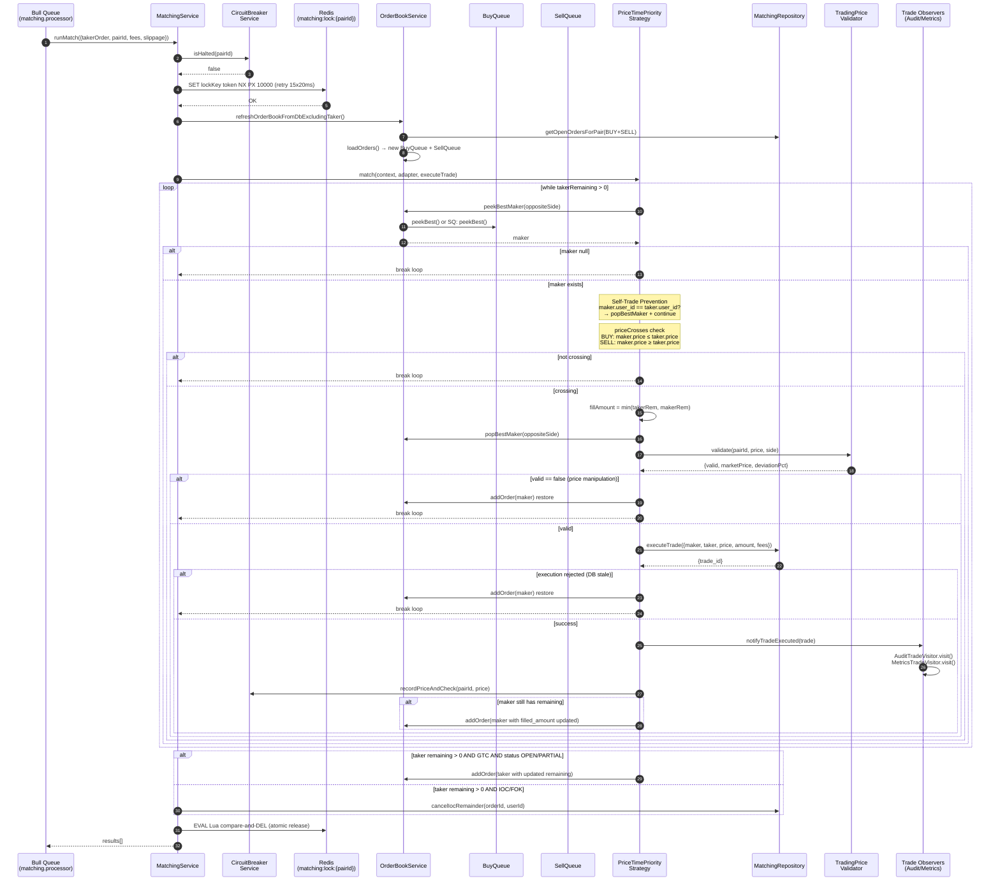
```mermaid
sequenceDiagram
    autonumber
    participant Q as Bull Queue<br/>(matching.processor)
    participant MS as MatchingService
    participant CB as CircuitBreaker<br/>Service
    participant LOCK as Redis<br/>(matching:lock:{pairId})
    participant OBS as OrderBookService
    participant BQ as BuyQueue
    participant SQ as SellQueue
    participant STRAT as PriceTimePriority<br/>Strategy
    participant REPO as MatchingRepository
    participant PV as TradingPrice<br/>Validator
    participant OBSV as Trade Observers<br/>(Audit/Metrics)

    Q->>MS: runMatch({takerOrder, pairId, fees, slippage})
    MS->>CB: isHalted(pairId)
    CB-->>MS: false
    MS->>LOCK: SET lockKey token NX PX 10000 (retry 15x20ms)
    LOCK-->>MS: OK

    MS->>OBS: refreshOrderBookFromDbExcludingTaker()
    OBS->>REPO: getOpenOrdersForPair(BUY+SELL)
    OBS->>OBS: loadOrders() → new BuyQueue + SellQueue

    MS->>STRAT: match(context, adapter, executeTrade)

    loop while takerRemaining > 0
        STRAT->>OBS: peekBestMaker(oppositeSide)
        OBS->>BQ: peekBest() or SQ: peekBest()
        OBS-->>STRAT: maker

        alt maker null
            STRAT-->>MS: break loop
        else maker exists
            Note over STRAT: Self-Trade Prevention<br/>maker.user_id == taker.user_id?<br/>→ popBestMaker + continue

            Note over STRAT: priceCrosses check<br/>BUY: maker.price ≤ taker.price<br/>SELL: maker.price ≥ taker.price
            alt not crossing
                STRAT-->>MS: break loop
            else crossing
                STRAT->>STRAT: fillAmount = min(takerRem, makerRem)
                STRAT->>OBS: popBestMaker(oppositeSide)
                STRAT->>PV: validate(pairId, price, side)
                PV-->>STRAT: {valid, marketPrice, deviationPct}

                alt valid == false (price manipulation)
                    STRAT->>OBS: addOrder(maker) restore
                    STRAT-->>MS: break loop
                else valid
                    STRAT->>REPO: executeTrade({maker, taker, price, amount, fees})
                    REPO-->>STRAT: {trade_id}

                    alt execution rejected (DB stale)
                        STRAT->>OBS: addOrder(maker) restore
                        STRAT-->>MS: break loop
                    else success
                        STRAT->>OBSV: notifyTradeExecuted(trade)
                        OBSV->>OBSV: AuditTradeVisitor.visit()<br/>MetricsTradeVisitor.visit()
                        STRAT->>CB: recordPriceAndCheck(pairId, price)

                        alt maker still has remaining
                            STRAT->>OBS: addOrder(maker with filled_amount updated)
                        end
                    end
                end
            end
        end
    end

    alt taker remaining > 0 AND GTC AND status OPEN/PARTIAL
        STRAT->>OBS: addOrder(taker with updated remaining)
    else taker remaining > 0 AND IOC/FOK
        MS->>REPO: cancelIocRemainder(orderId, userId)
    end

    MS->>LOCK: EVAL Lua compare-and-DEL (atomic release)
    MS-->>Q: results[]
```

### 1.2 Order Book data structure — 🟡

**TS** — `be-cryptocurrency-trading-app/src/modules/matching/domain/services/orderbook/`:

| Class | Path | Cấu trúc | Insert | Peek best | Remove |
|---|---|---|---|---|---|
| `OrderBookService` | `order-book.service.ts` | `Map<pairId, { buy, sell }>` | – | – | – |
| `OrderQueueService` | `order-queue.service.ts` | `OrderBookOrder[]` (plain array) | `push` rồi `sort` O(n log n) | `this.orders[0]` O(1) | `findIndex + splice` O(n) |
| `BuyQueueService` | `buy-queue.service.ts` | extends `OrderQueueService` với `sortDirection='DESC'` | – | – | – |
| `SellQueueService` | `sell-queue.service.ts` | extends `OrderQueueService` với `sortDirection='ASC'` | – | – | – |

**Class diagram — OrderBook (TS + Go)**:

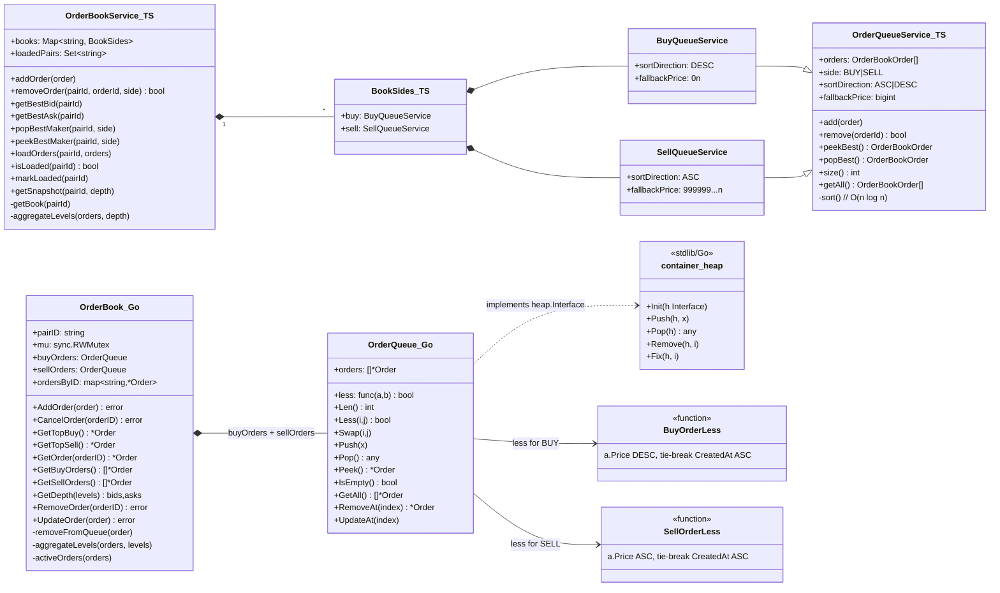
```mermaid
classDiagram
    direction LR

    class OrderBookService_TS {
        +books: Map~string, BookSides~
        +loadedPairs: Set~string~
        +addOrder(order)
        +removeOrder(pairId, orderId, side) bool
        +getBestBid(pairId)
        +getBestAsk(pairId)
        +popBestMaker(pairId, side)
        +peekBestMaker(pairId, side)
        +loadOrders(pairId, orders)
        +isLoaded(pairId) bool
        +markLoaded(pairId)
        +getSnapshot(pairId, depth)
        -getBook(pairId)
        -aggregateLevels(orders, depth)
    }

    class BookSides_TS {
        +buy: BuyQueueService
        +sell: SellQueueService
    }

    class OrderQueueService_TS {
        +orders: OrderBookOrder[]
        +side: BUY|SELL
        +sortDirection: ASC|DESC
        +fallbackPrice: bigint
        +add(order)
        +remove(orderId) bool
        +peekBest() OrderBookOrder
        +popBest() OrderBookOrder
        +size() int
        +getAll() OrderBookOrder[]
        -sort()  // O(n log n)
    }

    class BuyQueueService {
        +sortDirection: DESC
        +fallbackPrice: 0n
    }

    class SellQueueService {
        +sortDirection: ASC
        +fallbackPrice: 999999...n
    }

    OrderBookService_TS "1" *-- "*" BookSides_TS
    BookSides_TS *-- BuyQueueService
    BookSides_TS *-- SellQueueService
    BuyQueueService --|> OrderQueueService_TS
    SellQueueService --|> OrderQueueService_TS

    class OrderBook_Go {
        +pairID: string
        +mu: sync.RWMutex
        +buyOrders: OrderQueue
        +sellOrders: OrderQueue
        +ordersByID: map~string,*Order~
        +AddOrder(order) error
        +CancelOrder(orderID) error
        +GetTopBuy() *Order
        +GetTopSell() *Order
        +GetOrder(orderID) *Order
        +GetBuyOrders() []*Order
        +GetSellOrders() []*Order
        +GetDepth(levels) bids,asks
        +RemoveOrder(orderID) error
        +UpdateOrder(order) error
        -removeFromQueue(order)
        -aggregateLevels(orders, levels)
        -activeOrders(orders)
    }

    class OrderQueue_Go {
        +orders: []*Order
        +less: func(a,b) bool
        +Len() int
        +Less(i,j) bool
        +Swap(i,j)
        +Push(x)
        +Pop() any
        +Peek() *Order
        +IsEmpty() bool
        +GetAll() []*Order
        +RemoveAt(index) *Order
        +UpdateAt(index)
    }

    class container_heap {
        <<stdlib/Go>>
        +Init(h Interface)
        +Push(h, x)
        +Pop(h) any
        +Remove(h, i)
        +Fix(h, i)
    }

    OrderBook_Go *-- OrderQueue_Go : buyOrders + sellOrders
    OrderQueue_Go ..> container_heap : implements heap.Interface
    OrderQueue_Go --> BuyOrderLess : less for BUY
    OrderQueue_Go --> SellOrderLess : less for SELL

    class BuyOrderLess {
        <<function>>
        a.Price DESC, tie-break CreatedAt ASC
    }

    class SellOrderLess {
        <<function>>
        a.Price ASC, tie-break CreatedAt ASC
    }
```

**Comparison table rendered in diagram style**:

```mermaid
flowchart LR
    A[Price-Time Priority FIFO] --> B{Implementation}
    B -->|TypeScript| C[OrderQueueService<br/>Array + sort O(n log n)]
    B -->|Go| D[OrderQueue<br/>container/heap O(log n)]

    C --> C1["orders[]<br/>push + sort()<br/>peekBest() O(1)"]
    D --> D1["orders []*Order<br/>heap.Push/Pop<br/>Peek() O(1)"]

    style C fill:#fff3cd
    style D fill:#d1e7dd
```

> ⚠️ **Không phải O(log n)** như Red-Black Tree/Skip List. Vì orderbook sandbox thường vài nghìn order/pair nên chấp nhận được, nhưng cần đổi cấu trúc nếu lên production chính thức.

**Go** — `go-services/matching-engine/internal/domain/orderbook/`:

| File | Cấu trúc |
|---|---|
| `heap.go` | `container/heap` chuẩn (binary heap) – `Push`/`Pop`/`Remove` O(log n), `Peek` O(1) |
| `orderbook.go` | `OrderBook { buyOrders *OrderQueue; sellOrders *OrderQueue; ordersByID map[string]*Order }` – RWMutex bảo vệ concurrent access |

> ✅ Go đã đúng O(log n) nhờ binary heap. Comparator `BuyOrderLess` (DESC price + ASC createdAt) và `SellOrderLess` (ASC price + ASC createdAt).

**Kế hoạch nâng cấp TS lên O(log n)** (chỉ cần implement khi số order/pair > 10k, hiện tại sandbox đủ dùng):

- Thay `OrderQueueService.orders[]` bằng **Skip List** hoặc **Red-Black Tree** (package npm: `functional-red-black-tree`, `bintrees`, hoặc tự viết skip list ~200 LOC).
- Hoặc viết lại `OrderBookService` TS bằng cách wrap Go binary heap qua FFI (overkill cho sandbox).
- **Quyết định**: YAGNI cho giai đoạn sandbox — giữ array + sort, document rõ ở `docs/MATCHING_ENGINE_NOTES.md` (TODO: tạo file này).

### 1.3 Self-Trade Prevention (STP) — ✅

- TS `price-time-priority.strategy.ts:56-63` + `market-order.strategy.ts:55-62` — check **trước** price-cross và **không có flag opt-out** → always-on.
- Go `strategy.go:127-131` — cùng logic.
- Đã có test: `matching.ioc-fok.integration.spec.ts`, `orders-matching.integration.spec.ts`.

**Sequence diagram — STP flow trong PriceTimePriorityStrategy**:

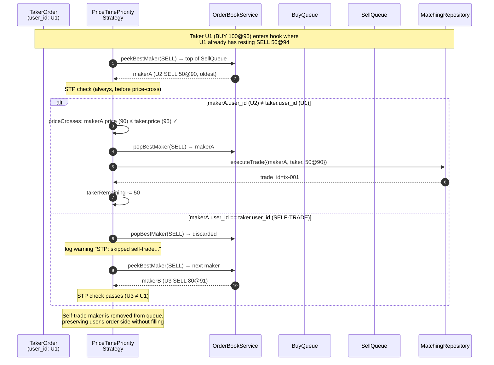
```mermaid
sequenceDiagram
    autonumber
    participant T as TakerOrder<br/>(user_id: U1)
    participant STRAT as PriceTimePriority<br/>Strategy
    participant OBS as OrderBookService
    participant BQ as BuyQueue
    participant SQ as SellQueue
    participant REPO as MatchingRepository

    Note over T,REPO: Taker U1 (BUY 100@95) enters book where<br/>U1 already has resting SELL 50@94

    STRAT->>OBS: peekBestMaker(SELL) → top of SellQueue
    OBS-->>STRAT: makerA (U2 SELL 50@90, oldest)

    Note over STRAT: STP check (always, before price-cross)
    alt makerA.user_id (U2) ≠ taker.user_id (U1)
        STRAT->>STRAT: priceCrosses: makerA.price (90) ≤ taker.price (95) ✓
        STRAT->>OBS: popBestMaker(SELL) → makerA
        STRAT->>REPO: executeTrade({makerA, taker, 50@90})
        REPO-->>STRAT: trade_id=tx-001
        STRAT->>STRAT: takerRemaining -= 50
    else makerA.user_id == taker.user_id (SELF-TRADE)
        STRAT->>OBS: popBestMaker(SELL) → discarded
        Note over STRAT: log warning "STP: skipped self-trade..."
        STRAT->>OBS: peekBestMaker(SELL) → next maker
        OBS-->>STRAT: makerB (U3 SELL 80@91)
        Note over STRAT: STP check passes (U3 ≠ U1)
    end

    Note over STRAT: Self-trade maker is removed from queue,<br/>preserving user's order side without filling
```

### 1.4 Circuit Breaker per pair — ✅

**File**: `be-cryptocurrency-trading-app/src/modules/matching/domain/services/circuit-breaker.service.ts`

```36:48:be-cryptocurrency-trading-app/src/modules/matching/domain/services/circuit-breaker.service.ts
  /**
   * Returns true when the pair is currently halted.
   */
  async isHalted(pairId: string): Promise<boolean> {
    const client = this.redisService.getClient();
    const value = await client.get(`${HALT_KEY_PREFIX}${pairId}`);
    return value !== null;
  }

  /**
   * Records the latest trade price for a pair and checks if the move within the window exceeds the threshold.
   * Returns true and writes a halt key if the circuit breaker fires; false otherwise.
   */
```

**Logic**:

1. Reference price lưu Redis ở `circuit:price:{pairId}` với TTL = `windowSec` (mặc định 60s).
2. Mỗi trade fill → `recordPriceAndCheck` so sánh `currentPrice` với reference bằng `Decimal.js`.
3. Nếu `|Δ%| ≥ thresholdPct` (mặc định 5%) → set `circuit:halt:{pairId}` với TTL = `haltDurationSec` (300s).
4. `MatchingService.runMatch` đọc `isHalted(pairId)` ở đầu (line 89-92), nếu true → return [] (không khớp).
5. Admin gọi `resumeTrading(pairId)` để `DEL` halt key.

**Generic circuit breaker** còn được dùng ở `src/common/outbox/circuit-breaker.ts` cho Kafka producer và projection consumer runner (Phase 5b/6, see `KafkaProducerCircuitBreakerService`).

**Class diagram**:

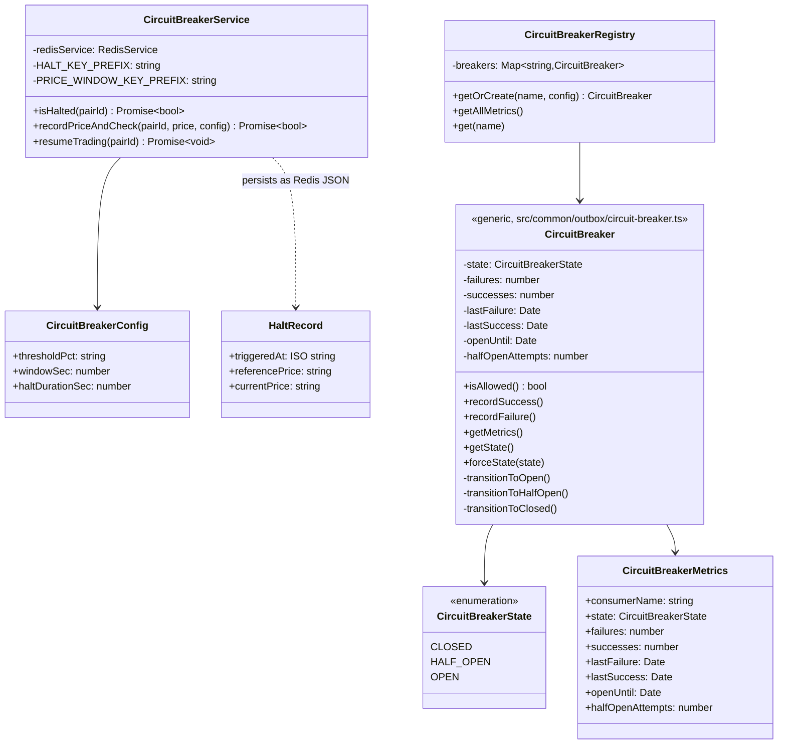
```mermaid
classDiagram
    class CircuitBreakerService {
        -redisService: RedisService
        +isHalted(pairId) Promise~bool~
        +recordPriceAndCheck(pairId, price, config) Promise~bool~
        +resumeTrading(pairId) Promise~void~
        -HALT_KEY_PREFIX: string
        -PRICE_WINDOW_KEY_PREFIX: string
    }

    class CircuitBreakerConfig {
        +thresholdPct: string
        +windowSec: number
        +haltDurationSec: number
    }

    class HaltRecord {
        +triggeredAt: ISO string
        +referencePrice: string
        +currentPrice: string
    }

    class CircuitBreaker {
        <<generic, src/common/outbox/circuit-breaker.ts>>
        -state: CircuitBreakerState
        -failures: number
        -successes: number
        -lastFailure: Date
        -lastSuccess: Date
        -openUntil: Date
        -halfOpenAttempts: number
        +isAllowed() bool
        +recordSuccess()
        +recordFailure()
        +getMetrics()
        +getState()
        +forceState(state)
        -transitionToOpen()
        -transitionToHalfOpen()
        -transitionToClosed()
    }

    class CircuitBreakerState {
        <<enumeration>>
        CLOSED
        HALF_OPEN
        OPEN
    }

    class CircuitBreakerRegistry {
        -breakers: Map~string,CircuitBreaker~
        +getOrCreate(name, config) CircuitBreaker
        +getAllMetrics()
        +get(name)
    }

    class CircuitBreakerMetrics {
        +consumerName: string
        +state: CircuitBreakerState
        +failures: number
        +successes: number
        +lastFailure: Date
        +lastSuccess: Date
        +openUntil: Date
        +halfOpenAttempts: number
    }

    CircuitBreakerService --> CircuitBreakerConfig
    CircuitBreakerService ..> HaltRecord : persists as Redis JSON
    CircuitBreaker --> CircuitBreakerState
    CircuitBreaker --> CircuitBreakerMetrics
    CircuitBreakerRegistry --> CircuitBreaker
```

**State diagram**:

```mermaid
stateDiagram-v2
    [*] --> CLOSED

    CLOSED --> OPEN : recordPriceAndCheck()<br/>|Δ%| ≥ thresholdPct<br/>SET circuit:halt:{pairId} EX haltDurationSec
    CLOSED --> CLOSED : |Δ%| < thresholdPct<br/>(only update reference price)

    OPEN --> HALF_OPEN : Date.now() ≥ openUntil<br/>(TTL expires, next request triggers)

    HALF_OPEN --> CLOSED : recordSuccess()<br/>(DEL halt key)
    HALF_OPEN --> OPEN : recordFailure()<br/>(restart TTL)

    OPEN --> OPEN : recordFailure()<br/>(reset timer, stay open)

    state OPEN {
        description: MatchingService.runMatch() reads isHalted() first →<br/>returns [] without trying to acquire lock or match.
        resumeTrading() admin override → DEL halt key.
    }

    state CLOSED {
        description: Normal operation. MatchingService.recordPriceAndCheck()<br/>called after each trade fill.
    }

    state HALF_OPEN {
        description: Recovery probe — allow 1 test attempt.<br/>On success → CLOSED; on failure → OPEN again.
    }
```

**Sequence diagram — Trigger & Recovery**:

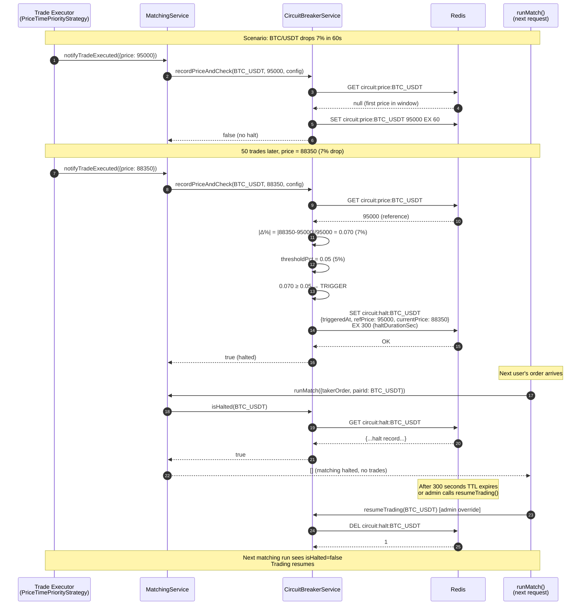
```mermaid
sequenceDiagram
    autonumber
    participant TRADE as Trade Executor<br/>(PriceTimePriorityStrategy)
    participant MS as MatchingService
    participant CB as CircuitBreakerService
    participant REDIS as Redis
    participant MATCH as runMatch()<br/>(next request)

    Note over TRADE,MATCH: Scenario: BTC/USDT drops 7% in 60s

    TRADE->>MS: notifyTradeExecuted({price: 95000})
    MS->>CB: recordPriceAndCheck(BTC_USDT, 95000, config)

    CB->>REDIS: GET circuit:price:BTC_USDT
    REDIS-->>CB: null (first price in window)

    CB->>REDIS: SET circuit:price:BTC_USDT 95000 EX 60
    CB-->>MS: false (no halt)

    Note over TRADE,MATCH: 50 trades later, price = 88350 (7% drop)

    TRADE->>MS: notifyTradeExecuted({price: 88350})
    MS->>CB: recordPriceAndCheck(BTC_USDT, 88350, config)

    CB->>REDIS: GET circuit:price:BTC_USDT
    REDIS-->>CB: 95000 (reference)

    CB->>CB: |Δ%| = |88350-95000|/95000 = 0.070 (7%)
    CB->>CB: thresholdPct = 0.05 (5%)
    CB->>CB: 0.070 ≥ 0.05 → TRIGGER

    CB->>REDIS: SET circuit:halt:BTC_USDT<br/>{triggeredAt, refPrice: 95000, currentPrice: 88350}<br/>EX 300 (haltDurationSec)
    REDIS-->>CB: OK
    CB-->>MS: true (halted)

    Note over MATCH: Next user's order arrives

    MATCH->>MS: runMatch({takerOrder, pairId: BTC_USDT})
    MS->>CB: isHalted(BTC_USDT)
    CB->>REDIS: GET circuit:halt:BTC_USDT
    REDIS-->>CB: {...halt record...}
    CB-->>MS: true
    MS-->>MATCH: [] (matching halted, no trades)

    Note over REDIS: After 300 seconds TTL expires<br/>or admin calls resumeTrading()

    MATCH->>CB: resumeTrading(BTC_USDT) [admin override]
    CB->>REDIS: DEL circuit:halt:BTC_USDT
    REDIS-->>CB: 1

    Note over TRADE,MATCH: Next matching run sees isHalted=false<br/>Trading resumes
```

---

## 2. Xử lý dữ liệu real-time

### 2.1 WebSocket streaming + pub/sub — ✅

**Files**:

- `be-cryptocurrency-trading-app/src/modules/trading/websocket/trading.gateway.ts` — Socket.IO gateway, namespace `/trading`, JWT auth, subscribe theo `pair:{id}:ticker` / `pair:{id}:ohlc:{interval}`.
- `be-cryptocurrency-trading-app/src/modules/trading/services/trading-price-stream.service.ts` — Redis pub/sub channels `trading:price_update` và `trading:candle_update`.
- `be-cryptocurrency-trading-app/src/modules/trading/clients/binance-websocket-price-feed.client.ts` — Demand-based Binance combined `@ticker` stream.
- `be-cryptocurrency-trading-app/src/modules/trading/services/binance-price-feed.service.ts` — Subscribe theo nhu cầu (chỉ những pair có client), `debounceTimer = 4s` để tránh reconnect liên tục.

**Multi-instance fan-out**: `trading.gateway.ts:95-105` — attach `@socket.io/redis-adapter` với pub/sub clients.

**Health check**: `lastSuccessfulPriceUpdateAt` + `lastPublishError` cho `/health`.

**Sequence diagram — Connect → Auth → Subscribe → Receive tick**:

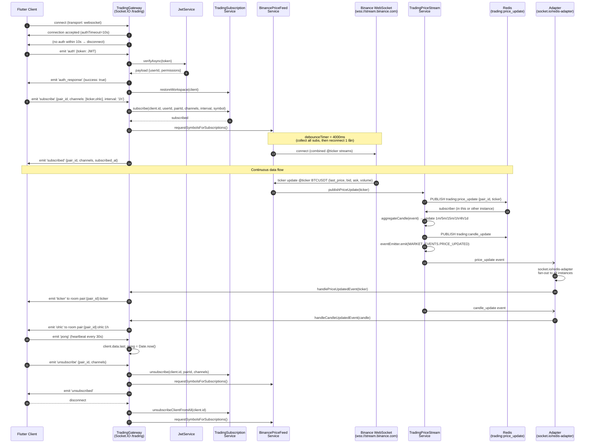
```mermaid
sequenceDiagram
    autonumber
    participant FE as Flutter Client
    participant GW as TradingGateway<br/>(Socket.IO /trading)
    participant JWT as JwtService
    participant SUB as TradingSubscription<br/>Service
    participant BPF as BinancePriceFeed<br/>Service
    participant WS as Binance WebSocket<br/>(wss://stream.binance.com)
    participant TPS as TradingPriceStream<br/>Service
    participant REDIS as Redis<br/>(trading:price_update)
    participant AD as Adapter<br/>(socket.io/redis-adapter)

    FE->>GW: connect (transport: websocket)
    GW->>FE: connection accepted (authTimeout=10s)
    GW->>FE: (no auth within 10s → disconnect)

    FE->>GW: emit 'auth' {token: JWT}
    GW->>JWT: verifyAsync(token)
    JWT-->>GW: payload {userId, permissions}
    GW->>FE: emit 'auth_response' {success: true}
    GW->>SUB: restoreWorkspace(client)

    FE->>GW: emit 'subscribe' {pair_id, channels: [ticker,ohlc], interval: '1h'}
    GW->>SUB: subscribe(client.id, userId, pairId, channels, interval, symbol)
    SUB-->>GW: subscribed
    GW->>BPF: requestSymbolsForSubscriptions()

    Note over BPF,WS: debounceTimer = 4000ms<br/>(collect all subs, then reconnect 1 lần)
    BPF->>WS: connect (combined @ticker streams)

    GW->>FE: emit 'subscribed' {pair_id, channels, subscribed_at}

    Note over FE,REDIS: Continuous data flow

    WS->>BPF: ticker update @ticker BTCUSDT (last_price, bid, ask, volume)
    BPF->>TPS: publishPriceUpdate(ticker)
    TPS->>REDIS: PUBLISH trading:price_update {pair_id, ticker}

    REDIS->>TPS: subscriber (in this or other instance)
    TPS->>TPS: aggregateCandle(event) → update 1m/5m/15m/1h/4h/1d
    TPS->>REDIS: PUBLISH trading:candle_update
    TPS->>TPS: eventEmitter.emit(MARKET_EVENTS.PRICE_UPDATED)

    TPS-)AD: price_update event
    AD->>AD: socket.io/redis-adapter<br/>fan-out to all instances
    AD->>GW: handlePriceUpdatedEvent(ticker)
    GW->>FE: emit 'ticker' to room pair:{pair_id}:ticker

    TPS-)AD: candle_update event
    AD->>GW: handleCandleUpdatedEvent(candle)
    GW->>FE: emit 'ohlc' to room pair:{pair_id}:ohlc:1h

    FE->>GW: emit 'pong' (heartbeat every 30s)
    GW->>GW: client.data.last_pong = Date.now()

    FE->>GW: emit 'unsubscribe' {pair_id, channels}
    GW->>SUB: unsubscribe(client.id, pairId, channels)
    GW->>BPF: requestSymbolsForSubscriptions()
    GW->>FE: emit 'unsubscribed'

    FE-->>GW: disconnect
    GW->>SUB: unsubscribeClientFromAll(client.id)
    GW->>BPF: requestSymbolsForSubscriptions()
```

### 2.2 OHLC aggregation (sliding window) — ✅

**File**: `be-cryptocurrency-trading-app/src/modules/trading/services/trading-price-stream.service.ts`

**Logic**:

```53:60:be-cryptocurrency-trading-app/src/modules/trading/services/trading-price-stream.service.ts
  private readonly intervalMsMap: Record<CandleInterval, number> = {
    '1m': 60_000,
    '5m': 5 * 60_000,
    '15m': 15 * 60_000,
    '1h': 60 * 60_000,
    '4h': 4 * 60 * 60_000,
    '1d': 24 * 60 * 60_000,
  };

  private candleCache: Map<string, OHLCMessage> = new Map();
  private candleKeyByPairInterval: Map<string, string> = new Map();
```

`aggregateCandle(event)` (line 124-200):

- Với mỗi interval (1m, 5m, 15m, 1h, 4h, 1d), tính `openTime = floor(timestamp / intervalMs) * intervalMs`.
- Nếu candle cũ đã đóng (openTime mới) → publish candle close event `is_closed=true`.
- Tạo candle mới (high=low=open=close=lastPrice, volume=0).
- Update high/low/close liên tục cho candle hiện tại.
- Publish qua Redis pub/sub `trading:candle_update`.
- `shouldSkipAggregateForPairInterval` — nếu Binance Kline feed đang live (≤ 90s gần đây) thì không overwrite bằng aggregated feed (ưu tiên Binance).

**Sliding window** đúng nghĩa: tại mỗi tick, candle hiện tại được update in-place; candle quá khứ được freeze + publish close. Memory bounded bởi số interval × số pair (6 × N pair).

**Class diagram**:

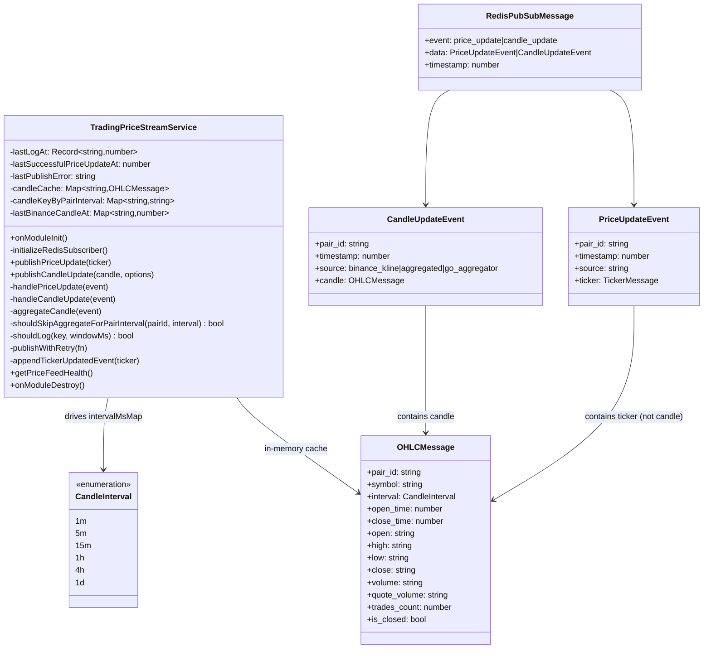
```mermaid
classDiagram
    class TradingPriceStreamService {
        -lastLogAt: Record~string,number~
        -lastSuccessfulPriceUpdateAt: number
        -lastPublishError: string
        -candleCache: Map~string,OHLCMessage~
        -candleKeyByPairInterval: Map~string,string~
        -lastBinanceCandleAt: Map~string,number~
        +onModuleInit()
        -initializeRedisSubscriber()
        +publishPriceUpdate(ticker)
        +publishCandleUpdate(candle, options)
        -handlePriceUpdate(event)
        -handleCandleUpdate(event)
        -aggregateCandle(event)
        -shouldSkipAggregateForPairInterval(pairId, interval) bool
        -shouldLog(key, windowMs) bool
        -publishWithRetry(fn)
        -appendTickerUpdatedEvent(ticker)
        +getPriceFeedHealth()
        +onModuleDestroy()
    }

    class OHLCMessage {
        +pair_id: string
        +symbol: string
        +interval: CandleInterval
        +open_time: number
        +close_time: number
        +open: string
        +high: string
        +low: string
        +close: string
        +volume: string
        +quote_volume: string
        +trades_count: number
        +is_closed: bool
    }

    class CandleInterval {
        <<enumeration>>
        1m
        5m
        15m
        1h
        4h
        1d
    }

    class PriceUpdateEvent {
        +pair_id: string
        +timestamp: number
        +source: string
        +ticker: TickerMessage
    }

    class CandleUpdateEvent {
        +pair_id: string
        +timestamp: number
        +source: binance_kline|aggregated|go_aggregator
        +candle: OHLCMessage
    }

    class RedisPubSubMessage {
        +event: price_update|candle_update
        +data: PriceUpdateEvent|CandleUpdateEvent
        +timestamp: number
    }

    TradingPriceStreamService --> OHLCMessage : in-memory cache
    TradingPriceStreamService --> CandleInterval : drives intervalMsMap
    PriceUpdateEvent --> OHLCMessage : contains ticker (not candle)
    CandleUpdateEvent --> OHLCMessage : contains candle
    RedisPubSubMessage --> PriceUpdateEvent
    RedisPubSubMessage --> CandleUpdateEvent
```

**Sequence diagram — OHLC sliding window aggregation**:

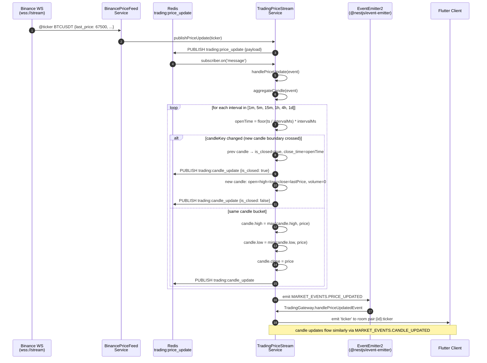
```mermaid
sequenceDiagram
    autonumber
    participant BINANCE as Binance WS<br/>(wss://stream)
    participant BPF as BinancePriceFeed<br/>Service
    participant REDIS as Redis<br/>trading:price_update
    participant TPS as TradingPriceStream<br/>Service
    participant AD as EventEmitter2<br/>(@nestjs/event-emitter)
    participant FE as Flutter Client

    BINANCE->>BPF: @ticker BTCUSDT {last_price: 67500, ...}
    BPF->>TPS: publishPriceUpdate(ticker)

    TPS->>REDIS: PUBLISH trading:price_update {payload}

    REDIS->>TPS: subscriber.on('message')
    TPS->>TPS: handlePriceUpdate(event)

    TPS->>TPS: aggregateCandle(event)

    loop for each interval in [1m, 5m, 15m, 1h, 4h, 1d]
        TPS->>TPS: openTime = floor(ts / intervalMs) * intervalMs

        alt candleKey changed (new candle boundary crossed)
            TPS->>TPS: prev candle → is_closed=true, close_time=openTime
            TPS->>REDIS: PUBLISH trading:candle_update {is_closed: true}

            TPS->>TPS: new candle: open=high=low=close=lastPrice, volume=0
            TPS->>REDIS: PUBLISH trading:candle_update {is_closed: false}
        else same candle bucket
            TPS->>TPS: candle.high = max(candle.high, price)
            TPS->>TPS: candle.low = min(candle.low, price)
            TPS->>TPS: candle.close = price
            TPS->>REDIS: PUBLISH trading:candle_update
        end
    end

    TPS->>AD: emit MARKET_EVENTS.PRICE_UPDATED
    AD->>TPS: TradingGateway.handlePriceUpdatedEvent
    TPS->>FE: emit 'ticker' to room pair:{id}:ticker

    Note over TPS,FE: candle updates flow similarly via MARKET_EVENTS.CANDLE_UPDATED
```

### 2.3 Circular Buffer / Ring Buffer cho tick — 🟡 (một phần)

**Hiện tại**:

- Frontend `fe-cryptocurrency-trading-app/lib/core/services/chart_cache_service.dart` — cap cứng `_maxCandlesPerKey = 43200` (~1 tháng 1m candles), trim bằng `sublist(merged.length - 43200)` khi vượt. Đây là **bounded FIFO list**, không phải ring buffer thực thụ (vẫn shift khi trim).
- Backend không giữ tick ring buffer — chỉ aggregate OHLC theo interval.

**Class diagram — ChartCacheService (bounded FIFO)**:

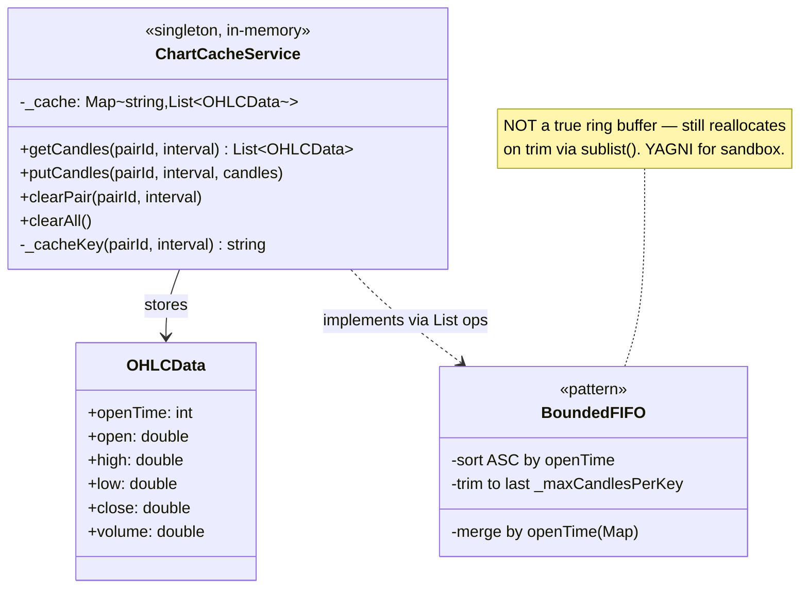
```mermaid
classDiagram
    class ChartCacheService {
        <<singleton, in-memory>>
        -_cache: Map~string,List~OHLCData~~
        +getCandles(pairId, interval) List~OHLCData~
        +putCandles(pairId, interval, candles)
        +clearPair(pairId, interval)
        +clearAll()
        -_cacheKey(pairId, interval) string
    }

    class OHLCData {
        +openTime: int
        +open: double
        +high: double
        +low: double
        +close: double
        +volume: double
    }

    class BoundedFIFO {
        <<pattern>>
        -merge by openTime (Map)
        -sort ASC by openTime
        -trim to last _maxCandlesPerKey
    }

    ChartCacheService --> OHLCData : stores
    ChartCacheService ..> BoundedFIFO : implements via List ops

    note for BoundedFIFO "NOT a true ring buffer — still reallocates<br/>on trim via sublist(). YAGNI for sandbox."
```

**Kế hoạch nâng cấp (khi cần tick-level cho VWAP/high-freq analytics)**:

- Backend: thêm `src/common/ring-buffer/circular-buffer.ts` — fixed-size array + head/tail pointer, O(1) push, O(1) read tail N. Dùng cho in-memory VWAP rolling trên 1000 tick gần nhất.
- Frontend: thêm `lib/core/utils/circular_buffer.dart` cho tick stream giữa WS reconnect.

> **Quyết định sandbox**: không cần implement ngay — sandbox traffic thấp, OHLC theo interval đủ dùng. Document ở Phase backlog.

### 2.4 Delta compression cho order book — ❌

**Hiện trạng**: Public WS chỉ stream `ticker` (last_price, bid, ask, volume_24h) và `ohlc`. **Không stream depth theo delta** (chỉ có `OrderBookService.getSnapshot(pairId, depth)` trả về full snapshot khi REST poll).

**Kế hoạch implement** (sandbox OK, không phụ thuộc mainnet):

1. **Backend `src/modules/trading/services/orderbook-stream.service.ts`** (mới):
   - Lắng nghe `MatchingService.onTradeExecuted` (đã có observer hook) → diff in-memory `OrderBookService.books` trước/sau.
   - Maintain 2 LRU cache `lastSnapshot[pairId]: DepthSnapshot` để so sánh.
   - Emit qua Redis pub/sub channel `orderbook:depth_diff:{pairId}` payload `{bids:[price, amount], asks:[price, amount], ts}` chỉ chứa level thay đổi.
2. **Gateway**: `TradingGateway.broadcastOrderBookDiff(pairId, diff)` — emit `orderbook_diff` event tới `pair:{pairId}:orderbook` room.
3. **FE** (`advanced_trading_screen.dart`): subscribe `orderbook_diff`, merge vào local `Map<price, level>`.
4. **Sequence number** chống reorder: `sequence: number` monotonic từ `OrderBookEvent.sequence` (đã có ở `EventStore`).

**Effort**: ~1 sprint. Ưu tiên trung bình — không block MVP.

---

## 3. Phân tích kỹ thuật (Technical Analysis)

### 3.1 SMA / EMA / RSI / MACD / Bollinger Bands — ✅ (Flutter)

**File**: `fe-cryptocurrency-trading-app/lib/core/services/indicator_service.dart`

**API**: Strategy Pattern qua `IIndicator<T>` abstract; mỗi indicator implement `calculate(List<double>)`.

| Indicator | Class | Công thức | Default |
|---|---|---|---|
| SMA | `MovingAverageIndicator(useEMA=false)` | `sum(subset) / period` | period=20 |
| EMA | `MovingAverageIndicator(useEMA=true)` | `k=2/(period+1)`, `ema = v*k + ema_prev*(1-k)` | period=12 |
| RSI | `RSIIndicator` | Wilder's smoothed avg gain/loss, `RSI = 100 - 100/(1+RS)` | period=14 |
| MACD | `MACDIndicator` | EMA12 − EMA26 = MACD, signal = EMA9(MACD), hist = MACD − signal | 12/26/9 |
| Bollinger | `BollingerBandsIndicator` | `mid=SMA20`, `upper=mid+2σ`, `lower=mid−2σ` | period=20, k=2.0 |

Facade `IndicatorService.calculateAllIndicators(closePrices, volumes)` trả về Map<String, dynamic>.

**Trade-off đã biết**: Mỗi lần tính lại toàn bộ từ `closePrices`. O(n × period) cho mỗi lần. Không incremental — nếu user add 1 candle mới, full recompute lại từ đầu (xem 3.3).

**Class diagram — Strategy Pattern**:

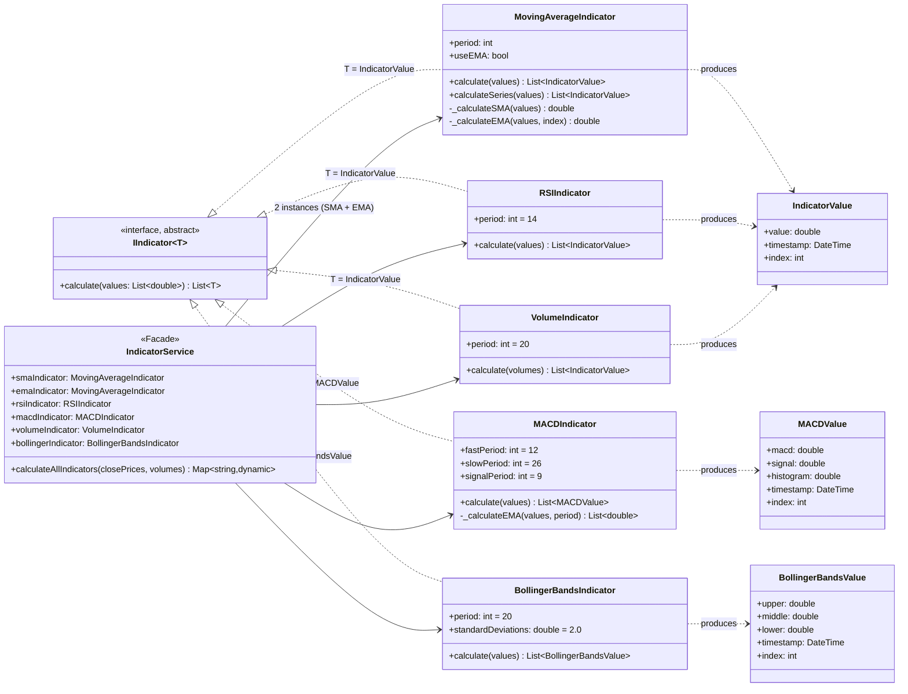
```mermaid
classDiagram
    direction LR

    class IIndicator~T~ {
        <<interface, abstract>>
        +calculate(values: List~double~) List~T~
    }

    class IndicatorValue {
        +value: double
        +timestamp: DateTime
        +index: int
    }

    class MACDValue {
        +macd: double
        +signal: double
        +histogram: double
        +timestamp: DateTime
        +index: int
    }

    class BollingerBandsValue {
        +upper: double
        +middle: double
        +lower: double
        +timestamp: DateTime
        +index: int
    }

    class MovingAverageIndicator {
        +period: int
        +useEMA: bool
        +calculate(values) List~IndicatorValue~
        +calculateSeries(values) List~IndicatorValue~
        -_calculateSMA(values) double
        -_calculateEMA(values, index) double
    }

    class RSIIndicator {
        +period: int = 14
        +calculate(values) List~IndicatorValue~
    }

    class MACDIndicator {
        +fastPeriod: int = 12
        +slowPeriod: int = 26
        +signalPeriod: int = 9
        +calculate(values) List~MACDValue~
        -_calculateEMA(values, period) List~double~
    }

    class VolumeIndicator {
        +period: int = 20
        +calculate(volumes) List~IndicatorValue~
    }

    class BollingerBandsIndicator {
        +period: int = 20
        +standardDeviations: double = 2.0
        +calculate(values) List~BollingerBandsValue~
    }

    class IndicatorService {
        <<Facade>>
        +smaIndicator: MovingAverageIndicator
        +emaIndicator: MovingAverageIndicator
        +rsiIndicator: RSIIndicator
        +macdIndicator: MACDIndicator
        +volumeIndicator: VolumeIndicator
        +bollingerIndicator: BollingerBandsIndicator
        +calculateAllIndicators(closePrices, volumes) Map~string,dynamic~
    }

    IIndicator~T~ <|.. MovingAverageIndicator : T = IndicatorValue
    IIndicator~T~ <|.. RSIIndicator : T = IndicatorValue
    IIndicator~T~ <|.. MACDIndicator : T = MACDValue
    IIndicator~T~ <|.. VolumeIndicator : T = IndicatorValue
    IIndicator~T~ <|.. BollingerBandsIndicator : T = BollingerBandsValue

    MovingAverageIndicator ..> IndicatorValue : produces
    RSIIndicator ..> IndicatorValue : produces
    MACDIndicator ..> MACDValue : produces
    VolumeIndicator ..> IndicatorValue : produces
    BollingerBandsIndicator ..> BollingerBandsValue : produces

    IndicatorService --> MovingAverageIndicator : 2 instances (SMA + EMA)
    IndicatorService --> RSIIndicator
    IndicatorService --> MACDIndicator
    IndicatorService --> VolumeIndicator
    IndicatorService --> BollingerBandsIndicator
```

**Sequence diagram — calculateAllIndicators từ REST fetch → indicator cache**:

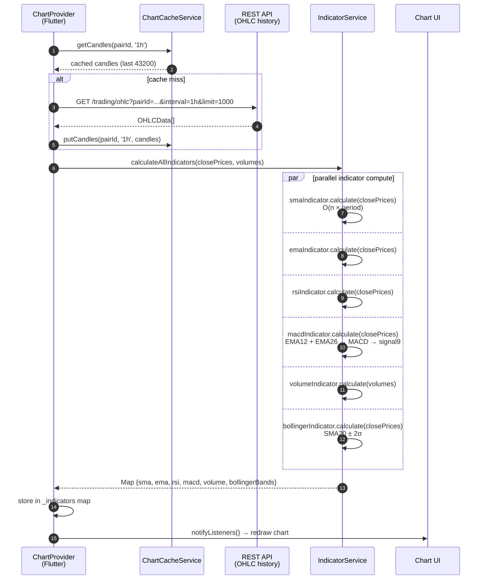
```mermaid
sequenceDiagram
    autonumber
    participant FE as ChartProvider<br/>(Flutter)
    participant CACHE as ChartCacheService
    participant REST as REST API<br/>(OHLC history)
    participant IND as IndicatorService
    participant UI as Chart UI

    FE->>CACHE: getCandles(pairId, '1h')
    CACHE-->>FE: cached candles (last 43200)

    alt cache miss
        FE->>REST: GET /trading/ohlc?pairId=...&interval=1h&limit=1000
        REST-->>FE: OHLCData[]
        FE->>CACHE: putCandles(pairId, '1h', candles)
    end

    FE->>IND: calculateAllIndicators(closePrices, volumes)

    par parallel indicator compute
        IND->>IND: smaIndicator.calculate(closePrices)<br/>O(n × period)
    and
        IND->>IND: emaIndicator.calculate(closePrices)
    and
        IND->>IND: rsiIndicator.calculate(closePrices)
    and
        IND->>IND: macdIndicator.calculate(closePrices)<br/>EMA12 + EMA26 → MACD → signal9
    and
        IND->>IND: volumeIndicator.calculate(volumes)
    and
        IND->>IND: bollingerIndicator.calculate(closePrices)<br/>SMA20 ± 2σ
    end

    IND-->>FE: Map {sma, ema, rsi, macd, volume, bollingerBands}

    FE->>FE: store in _indicators map
    FE->>UI: notifyListeners() → redraw chart
```

### 3.2 Kalman Filter / Exponential Smoothing — ❌

**Kế hoạch** (logic-only, sandbox OK):

Thêm `fe-cryptocurrency-trading-app/lib/core/services/noise_filter_service.dart`:

```dart
class KalmanFilter1D {
  double _x = 0;       // state estimate
  double _p = 1;       // estimation error covariance
  final double q;      // process noise covariance
  final double r;      // measurement noise covariance

  KalmanFilter1D({this.q = 0.01, this.r = 0.5});

  double update(double measurement) {
    // Predict
    _p += q;
    // Update
    final k = _p / (_p + r);
    _x = _x + k * (measurement - _x);
    _p = (1 - k) * _p;
    return _x;
  }
}
```

Dùng để smooth `last_price` ticker trước khi vẽ chart — giảm noise từ spread/wicks ngắn. Wire vào `ChartProvider._handleTickerUpdate` sau khi nhận tick.

### 3.3 Incremental (streaming) recompute — ❌

**Hiện trạng**: `IndicatorService.calculateAllIndicators` chạy lại từ đầu mỗi lần FE nhận candle mới. Với 43200 candles × 20 period = 864k phép tính mỗi tick → chậm.

**Kế hoạch incremental** (logic-only, sandbox OK):

Thêm streaming variants:

```dart
class StreamingSMA {
  final Queue<double> _window = Queue();
  double _sum = 0;
  final int period;
  StreamingSMA(this.period);

  double? update(double v) {
    _window.add(v);
    _sum += v;
    if (_window.length > period) _sum -= _window.removeFirst();
    return _window.length == period ? _sum / period : null;
  }
}

class StreamingEMA {
  double? _ema;
  final int period;
  final double k;
  StreamingEMA(this.period) : k = 2 / (period + 1);

  double update(double v) {
    _ema = _ema == null ? v : v * k + _ema! * (1 - k);
    return _ema!;
  }
}
```

Refactor `ChartProvider` giữ instance `StreamingSMA`, `StreamingEMA`, `StreamingRSI` cho mỗi (pairId, interval); mỗi tick/candle mới chỉ update O(1) thay vì recompute O(n).

**Effort**: ~3 ngày. Ưu tiên trung bình.

---

## 4. Risk & Execution

### 4.1 Position sizing — 🟡 (MarketMaker spread only)

**Hiện tại**:

- `be-cryptocurrency-trading-app/src/modules/market-maker/services/mm-order-strategy.service.ts` — `spread_bps / 10000`, `midPrice = (bid + ask) / 2`, amount cố định (`config.order_amount`). Đây là **Fixed Fractional** cơ bản (cố định % balance, fixed size).
- KHÔNG có Kelly Criterion.

**Class diagram — MarketMaker spread strategy**:

```mermaid
classDiagram
    class MmOrderStrategyService {
        -cacheService: CacheService
        -marketsService: MarketsService
        -ordersService: OrdersService
        +placeMakerOrders(params) Promise~result~
        -resolveMidPrice(symbol, pairId) Promise~number~
        -midPriceFromTicker(ticker) number
        -roundByScale(value, scale) number
        -toFixedNoSci(value, scale) string
    }

    class MarketMakerConfig {
        +spread_bps: number  // 50 = 0.5%
        +order_amount: string  // fixed per order
        +max_position: string
    }

    class RedisTickerPayload {
        +last_price?: string
        +bid?: string
        +ask?: string
    }

    class RedisLatestKey {
        <<key schema>>
        price:{SYMBOL}:latest
    }

    MmOrderStrategyService --> MarketMakerConfig : reads
    MmOrderStrategyService --> RedisTickerPayload : consumes
    MmOrderStrategyService ..> RedisLatestKey : reads
    MmOrderStrategyService --> MarketsService : findOne / getTicker
    MmOrderStrategyService --> OrdersService : createBatch
```

**Sequence diagram — MarketMaker place 2-sided orders**:

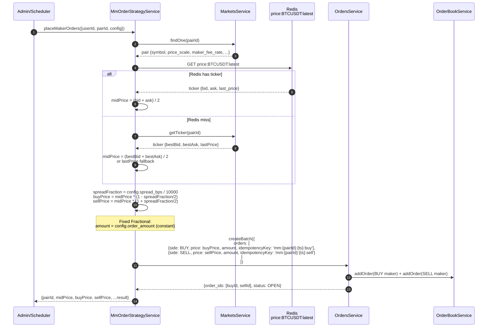
```mermaid
sequenceDiagram
    autonumber
    participant ADM as Admin/Scheduler
    participant MM as MmOrderStrategyService
    participant MKT as MarketsService
    participant REDIS as Redis<br/>price:BTCUSDT:latest
    participant ORD as OrdersService
    participant OBS as OrderBookService

    ADM->>MM: placeMakerOrders({userId, pairId, config})

    MM->>MKT: findOne(pairId)
    MKT-->>MM: pair {symbol, price_scale, maker_fee_rate, ...}

    MM->>REDIS: GET price:BTCUSDT:latest
    alt Redis has ticker
        REDIS-->>MM: ticker {bid, ask, last_price}
        MM->>MM: midPrice = (bid + ask) / 2
    else Redis miss
        MM->>MKT: getTicker(pairId)
        MKT-->>MM: ticker {bestBid, bestAsk, lastPrice}
        MM->>MM: midPrice = (bestBid + bestAsk) / 2<br/>or lastPrice fallback
    end

    MM->>MM: spreadFraction = config.spread_bps / 10000<br/>buyPrice  = midPrice * (1 - spreadFraction/2)<br/>sellPrice = midPrice * (1 + spreadFraction/2)

    Note over MM: Fixed Fractional:<br/>amount = config.order_amount (constant)

    MM->>ORD: createBatch({<br/>  orders: [<br/>    {side: BUY, price: buyPrice, amount, idempotencyKey: 'mm:{pairId}:{ts}:buy'},<br/>    {side: SELL, price: sellPrice, amount, idempotencyKey: 'mm:{pairId}:{ts}:sell'}<br/>  ]<br/>})

    ORD->>OBS: addOrder(BUY maker) + addOrder(SELL maker)
    ORD-->>MM: {order_ids: [buyId, sellId], status: OPEN}

    MM-->>ADM: {pairId, midPrice, buyPrice, sellPrice, ...result}
```

**Kế hoạch bổ sung Kelly Criterion + Fixed Fractional** (logic-only, sandbox OK):

File mới `src/modules/risk/position-sizing.service.ts`:

```ts
@Injectable()
export class PositionSizingService {
  /**
   * Kelly Criterion: f* = (p*W - L) / W
   * p = win rate, W = avg win / loss ratio, L = 1
   * Trả về fraction của bankroll để risk.
   */
  kellyFraction(p: number, winLossRatio: number): number {
    return Math.max(0, (p * winLossRatio - (1 - p)) / winLossRatio);
  }

  /**
   * Fixed Fractional: risk cố định fraction F của balance mỗi lệnh.
   * Nếu balance = 10_000 USDT, F = 0.02 → risk 200 USDT/lệnh.
   */
  fixedFractionalSize(balance: Decimal, fraction: number, entryPrice: Decimal, stopLossPrice: Decimal): Decimal {
    const riskPerUnit = entryPrice.minus(stopLossPrice).abs();
    if (riskPerUnit.lte(0)) throw new BusinessException('Invalid stop loss', 'INVALID_STOP');
    const riskAmount = balance.mul(fraction);
    return riskAmount.div(riskPerUnit);
  }
}
```

Cần: bảng `user_risk_metrics` lưu `win_rate`, `avg_win_loss_ratio`, `risk_fraction`, `stop_loss_pct`. Tính rolling từ `trades` history. Wire vào `CreateOrderUseCase.validate(prepared.validationContext)` — nếu size > Kelly cap → reject.

**Effort**: ~1 sprint (kèm backtest metrics + UI admin config).

### 4.2 Slippage estimation — ✅

**Files**:

- `src/modules/matching/domain/services/strategies/market-order.strategy.ts:38-86` — `MarketOrderStrategy`:
  - `takerReferencePriceBu` = giá fill đầu tiên (anchor).
  - BUY taker: `threshold = ref * (1 + tolerance)`; SELL: `threshold = ref * (1 − tolerance)`.
  - Nếu `makerPrice` vượt threshold → pop maker, restore vào book (giữ thanh khoản), break matching.
- `src/modules/matching/domain/services/trading-price-validator.service.ts` — `validate(pairId, tradePrice, side)` so với CoinGecko market price, deviation pct, max 1% (configurable qua `trading.max_slippage_pct`).

Đây chính là **slippage protection** 2 lớp:
1. Market-order level: chống trượt giá trong 1 lệnh.
2. Trade-execution level: chống khớp giá quá xa market (chống price manipulation, attacker place stale limit order).

**Class diagram**:

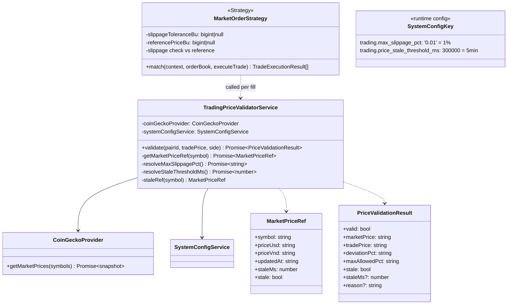
```mermaid
classDiagram
    class MarketOrderStrategy {
        <<Strategy>>
        -slippageToleranceBu: bigint|null
        -referencePriceBu: bigint|null
        +match(context, orderBook, executeTrade) TradeExecutionResult[]
        -slippage check vs reference
    }

    class TradingPriceValidatorService {
        -coinGeckoProvider: CoinGeckoProvider
        -systemConfigService: SystemConfigService
        +validate(pairId, tradePrice, side) Promise~PriceValidationResult~
        -getMarketPriceRef(symbol) Promise~MarketPriceRef~
        -resolveMaxSlippagePct() Promise~string~
        -resolveStaleThresholdMs() Promise~number~
        -staleRef(symbol) MarketPriceRef
    }

    class MarketPriceRef {
        +symbol: string
        +priceUsd: string
        +priceVnd: string
        +updatedAt: string
        +staleMs: number
        +stale: bool
    }

    class PriceValidationResult {
        +valid: bool
        +marketPrice: string
        +tradePrice: string
        +deviationPct: string
        +maxAllowedPct: string
        +stale: bool
        +staleMs?: number
        +reason?: string
    }

    class SystemConfigKey {
        <<runtime config>>
        trading.max_slippage_pct: '0.01' = 1%
        trading.price_stale_threshold_ms: 300000 = 5min
    }

    class CoinGeckoProvider {
        +getMarketPrices(symbols) Promise~snapshot~
    }

    MarketOrderStrategy ..> TradingPriceValidatorService : called per fill
    TradingPriceValidatorService --> CoinGeckoProvider
    TradingPriceValidatorService --> SystemConfigService
    TradingPriceValidatorService ..> MarketPriceRef
    TradingPriceValidatorService ..> PriceValidationResult
```

**Sequence diagram — 2-layer slippage protection**:

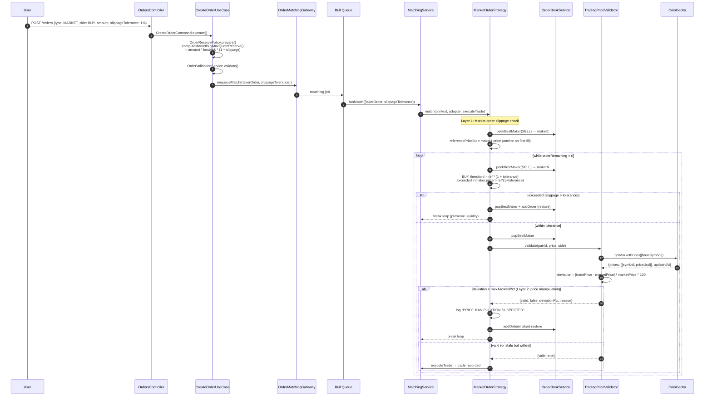
```mermaid
sequenceDiagram
    autonumber
    participant USER as User
    participant CTRL as OrdersController
    participant UC as CreateOrderUseCase
    participant GATEWAY as OrderMatchingGateway
    participant Q as Bull Queue
    participant MS as MatchingService
    participant STRAT as MarketOrderStrategy
    participant OBS as OrderBookService
    participant PV as TradingPriceValidator
    participant CG as CoinGecko

    USER->>CTRL: POST /orders {type: MARKET, side: BUY, amount, slippageTolerance: 1%}
    CTRL->>UC: CreateOrderCommand.execute()

    UC->>UC: OrderReservePolicy.prepare()<br/>computeMarketBuyMaxQuoteReserve()<br/>= amount * bestAsk * (1 + slippage)
    UC->>UC: OrderValidationService.validate()
    UC->>GATEWAY: enqueueMatch({takerOrder, slippageTolerance})

    GATEWAY->>Q: matching job
    Q->>MS: runMatch({takerOrder, slippageTolerance})
    MS->>STRAT: match(context, adapter, executeTrade)

    Note over STRAT: Layer 1: Market-order slippage check
    STRAT->>OBS: peekBestMaker(SELL) → maker1
    STRAT->>STRAT: referencePriceBu = maker1.price (anchor on first fill)

    loop while takerRemaining > 0
        STRAT->>OBS: peekBestMaker(SELL) → makerN
        STRAT->>STRAT: BUY threshold = ref * (1 + tolerance)<br/>exceeded if maker.price > ref*(1+tolerance)

        alt exceeded (slippage > tolerance)
            STRAT->>OBS: popBestMaker + addOrder (restore)
            STRAT-->>MS: break loop (preserve liquidity)
        else within tolerance
            STRAT->>OBS: popBestMaker
            STRAT->>PV: validate(pairId, price, side)
            PV->>CG: getMarketPrices([baseSymbol])
            CG-->>PV: {prices: [{symbol, priceUsd}], updatedAt}
            PV->>PV: deviation = |tradePrice - marketPrice| / marketPrice * 100
            alt deviation > maxAllowedPct (Layer 2: price manipulation)
                PV-->>STRAT: {valid: false, deviationPct, reason}
                STRAT->>STRAT: log "PRICE MANIPULATION SUSPECTED"
                STRAT->>OBS: addOrder(maker) restore
                STRAT-->>MS: break loop
            else valid (or stale but within)
                PV-->>STRAT: {valid: true}
                STRAT->>MS: executeTrade → trade recorded
            end
        end
    end
```

### 4.3 Idempotency key + distributed lock — ✅

**Files**:

- `src/modules/orders/application/use-cases/create-order.use-case.ts:21-22, 63-74`:
  - Cache key `order:idempotency:{userId}:{key}`, TTL 24h, lưu snapshot JSON của order.
  - Check Redis cache trước, fallback DB `findByUserIdempotency`, mới cho tạo mới.
- `src/common/utils/redis-distributed-lock.ts` — utility chung dùng cho mọi module cần lock (matching, outbox relay, scheduler, treasury).

```7:14:be-cryptocurrency-trading-app/src/common/utils/redis-distributed-lock.ts
const RELEASE_LOCK_SCRIPT = `
if redis.call('GET', KEYS[1]) == ARGV[1] then
  return redis.call('DEL', KEYS[1])
end
return 0
`;
```

**Cơ chế**:

1. `SET lockKey lockToken NX EX ttlSeconds` — atomic acquire.
2. Mỗi caller có token unique `pid-timestamp-random`.
3. `finally` → `EVAL` Lua compare-and-delete: chỉ DEL nếu value khớp token (chống nhầm release lock của instance khác).
4. Nếu `acquired = false` → skip silently (idempotent scheduler pattern).

**Dùng ở**:

- `matching/matching.service.ts` — `matching:lock:{pairId}` TTL 10s, retry 15×20ms (line 85-107).
- `outbox/outbox-relay.service.ts` — `outbox:relay:lock`.
- `treasury/main-wallet-rotation.scheduler.ts` — main wallet rotation.
- `payment-config/payment-config-grace.scheduler.ts` — grace scheduler.

**Kết hợp idempotency + lock = không bao giờ double-execute**: order retry từ client → cùng `idempotencyKey` → Redis cache hit → trả về order cũ. Nếu Redis cache miss + DB có row cũ → cũng return cũ. Lock Redis đảm bảo DB write cũng chỉ 1 instance chạy tại 1 thời điểm.

**Class diagram — Idempotency + Distributed Lock**:

```mermaid
classDiagram
    class CreateOrderUseCase {
        -logger: Logger
        -orderRepository: OrderRepositoryPort
        -cacheService: CacheService
        -validationService: OrderValidationService
        -orderMatchingGateway: OrderMatchingGatewayPort
        -prepareCreateOrderContextService
        -orderReservePolicy: OrderReservePolicy
        -outboxAppender: OutboxAppender
        +execute(command) Promise~Order~
        -enqueueMatching(order, feeCurrencyId, ...)
        -appendOrderCreatedEvent(order)
        -appendOrderRejectedEvent(input)
    }

    class withDistributedLock {
        <<utility, redis-distributed-lock.ts>>
        +withDistributedLock(redis, opts, fn, logger) Promise~bool~
        -SET lockKey token NX EX ttl
        -EVAL release Lua compare-and-DEL
    }

    class RedisService {
        -client: ioredis
        -publisher: ioredis
        -subscriber: ioredis
        +setIfNotExists(key, value, ttl) Promise~bool~
        +getClient() ioredis
        +getPublisher() ioredis
        +getSubscriber() ioredis
        +eval(script, keys, args)
    }

    class DistributedLockOptions {
        +lockKey: string
        +ttlSeconds: number
        +callerName?: string
    }

    class RELEASE_LOCK_LUA {
        <<Lua script>>
        if redis.call('GET', KEYS[1]) == ARGV[1] then<br/>  return redis.call('DEL', KEYS[1])<br/>end<br/>return 0
    }

    class IdempotencyCacheKey {
        <<schema>>
        order:idempotency:{userId}:{key}<br/>TTL: 86400s (24h)
        Value: PlainOrderResponse JSON
    }

    class MatchingLock {
        <<schema>>
        matching:lock:{pairId}<br/>TTL: 10000ms<br/>Value: random hex token (16 bytes)
    }

    class OutboxRelayLock {
        <<schema>>
        outbox:relay:lock
    }

    CreateOrderUseCase --> RedisService : via cacheService
    CreateOrderUseCase ..> IdempotencyCacheKey : reads/writes
    withDistributedLock --> RedisService : SET NX EX + EVAL Lua
    withDistributedLock --> DistributedLockOptions
    withDistributedLock ..> RELEASE_LOCK_LUA : atomic release
    withDistributedLock ..> MatchingLock
    withDistributedLock ..> OutboxRelayLock
```

**Sequence diagram — Create order với idempotency + lock**:

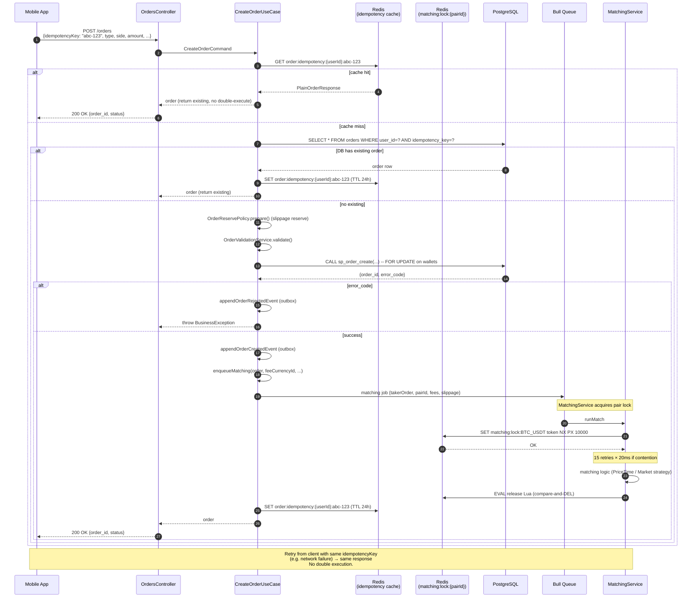
```mermaid
sequenceDiagram
    autonumber
    participant CLIENT as Mobile App
    participant CTRL as OrdersController
    participant UC as CreateOrderUseCase
    participant CACHE as Redis<br/>(idempotency cache)
    participant LOCK as Redis<br/>(matching:lock:{pairId})
    participant DB as PostgreSQL
    participant Q as Bull Queue
    participant MS as MatchingService

    CLIENT->>CTRL: POST /orders<br/>{idempotencyKey: "abc-123", type, side, amount, ...}

    CTRL->>UC: CreateOrderCommand

    UC->>CACHE: GET order:idempotency:{userId}:abc-123
    alt cache hit
        CACHE-->>UC: PlainOrderResponse
        UC-->>CTRL: order (return existing, no double-execute)
        CTRL-->>CLIENT: 200 OK {order_id, status}
    else cache miss
        UC->>DB: SELECT * FROM orders WHERE user_id=? AND idempotency_key=?
        alt DB has existing order
            DB-->>UC: order row
            UC->>CACHE: SET order:idempotency:{userId}:abc-123 (TTL 24h)
            UC-->>CTRL: order (return existing)
        else no existing
            UC->>UC: OrderReservePolicy.prepare() (slippage reserve)
            UC->>UC: OrderValidationService.validate()
            UC->>DB: CALL sp_order_create(...) -- FOR UPDATE on wallets
            DB-->>UC: {order_id, error_code}
            alt error_code
                UC->>UC: appendOrderRejectedEvent (outbox)
                UC-->>CTRL: throw BusinessException
            else success
                UC->>UC: appendOrderCreatedEvent (outbox)
                UC->>UC: enqueueMatching(order, feeCurrencyId, ...)

                UC->>Q: matching job {takerOrder, pairId, fees, slippage}

                Note over Q,MS: MatchingService acquires pair lock
                Q->>MS: runMatch
                MS->>LOCK: SET matching:lock:BTC_USDT token NX PX 10000
                LOCK-->>MS: OK
                Note over MS: 15 retries × 20ms if contention
                MS->>MS: matching logic (PriceTime / Market strategy)
                MS->>LOCK: EVAL release Lua (compare-and-DEL)

                UC->>CACHE: SET order:idempotency:{userId}:abc-123 (TTL 24h)
                UC-->>CTRL: order
                CTRL-->>CLIENT: 200 OK {order_id, status}
            end
        end
    end

    Note over CLIENT,MS: Retry from client with same idempotencyKey<br/>(e.g. network failure) → same response<br/>No double execution.
```

**Distributed lock acquisition race**:

```mermaid
sequenceDiagram
    autonumber
    participant INST1 as Backend Instance 1
    participant INST2 as Backend Instance 2
    participant LOCK as Redis<br/>(matching:lock:BTC_USDT)

    Note over INST1,INST2: Both instances try to runMatch for same pair

    INST1->>LOCK: SET matching:lock:BTC_USDT token1 NX PX 10000
    LOCK-->>INST1: OK (winner)

    INST2->>LOCK: SET matching:lock:BTC_USDT token2 NX PX 10000
    LOCK-->>INST2: null (lost NX)

    loop up to 15 times × 20ms delay
        INST2->>LOCK: SET ... NX PX 10000
        alt still locked
            LOCK-->>INST2: null
            INST2->>INST2: sleep(20ms)
        else lock released (TTL expired or instance1 finished)
            LOCK-->>INST2: OK
        end
    end

    alt all retries exhausted
        INST2->>INST2: throw MatchingLockContentionError<br/>order stays in queue, retried later
    end

    Note over INST1,LOCK: Instance 1 finishes matching

    INST1->>LOCK: EVAL release Lua (compare value == token1)
    LOCK-->>INST1: 1 (deleted) or 0 (already expired)
```

---

## 5. Consistency & Concurrency

### 5.1 Optimistic / Pessimistic Locking cho balance — ✅

**MySQL store procedures (legacy)**: rất nhiều `SELECT … FOR UPDATE` cho wallets + orders — xem `src/migrations_legacy_mysql/`:

| Migration | Mục đích |
|---|---|
| `1775500000000-FixSpOrderCreateWalletLockForUpdate.ts` | Thêm `FOR UPDATE` trước balance check để fix race condition |
| `1768226600000-CreateWalletsProcedures.ts` | "Quản lý balance atomically với pessimistic locking" |
| `1768227800000-RecreateUsersAndWalletsProceduresUuidV7.ts` | `LIMIT 1 FOR UPDATE` cho wallet lookup |
| `1775510000000-MatchingEngineHardening.ts` | `FOR UPDATE` trong matching trade execution |
| `1775450000000-TradeExecuteEnsureSettlementWallets.ts` | Lock settlement wallets khi trade |

**TypeScript repositories (Postgres)** — vẫn dùng `FOR UPDATE` trong raw queries:

| File | Dòng |
|---|---|
| `src/modules/orders/infrastructure/persistence/order.repository.impl.ts` | 391, 418, 434 |
| `src/modules/matching/infrastructure/persistence/matching.repository.ts` | 418, 445, 462 |
| `src/modules/users/infrastructure/persistence/users.repository.ts` | 417 |
| `src/modules/wallets/infrastructure/persistence/wallet.repository.impl.ts` | 144 |

**Best-effort optimistic**: order entity có `version` column (xem `src/entities/order.entity.ts`) — check version khi update. Khi conflict → retry hoặc trả lỗi `OPTIMISTIC_LOCK_FAILED`.

**Migration**: đang dần chuyển từ MySQL sang Postgres (xem `docs/MIGRATION_CHECKLIST.md`). Postgres có `SELECT … FOR UPDATE` tương đương + `SERIALIZABLE` isolation nếu cần strict hơn.

**Class diagram — Locking patterns**:

```mermaid
classDiagram
    direction LR

    class OrderEntity {
        +id: UUID
        +user_id: UUID
        +idempotency_key: string
        +status: OrderStatus
        +version: number  <<optimistic>>
        +wallet_id: UUID
        +pair_id: UUID
        +side: BUY|SELL
        +type: LIMIT|MARKET
        +price: string
        +amount: string
        +filled_amount: string
        +created_at: DateTime
        +updated_at: DateTime
    }

    class WalletEntity {
        +id: UUID
        +user_id: UUID
        +currency_id: UUID
        +balance: string  <<bigint base units>>
        +locked_balance: string
        +version: number
    }

    class OrderRepositoryImpl {
        +findByUserIdempotency(userId, key)
        +reserveBalanceWithLock(orderId, walletId)
        +updateOrderStatusWithVersion(orderId, status, expectedVersion)
    }

    class WalletRepositoryImpl {
        +selectForUpdate(walletId, txn) Wallet  // SELECT … FOR UPDATE
        +adjustBalance(walletId, delta, txn)
        +adjustLockedBalance(walletId, delta, txn)
    }

    class MatchingRepository {
        +executeTradeWithWalletLock(trade, txn)
        +getOpenOrdersForPairForUpdate(pairId, txn)
    }

    class PostgresTransaction {
        +BEGIN ISOLATION LEVEL READ COMMITTED
        +SELECT … FOR UPDATE
        +SELECT … FOR UPDATE NOWAIT
        +SELECT … FOR UPDATE SKIP LOCKED
        +COMMIT / ROLLBACK
    }

    class OptimisticLockConflict {
        <<exception>>
        OPTIMISTIC_LOCK_FAILED
    }

    OrderRepositoryImpl --> OrderEntity
    OrderRepositoryImpl --> PostgresTransaction
    OrderRepositoryImpl ..> OptimisticLockConflict : throws on version mismatch
    WalletRepositoryImpl --> WalletEntity
    WalletRepositoryImpl --> PostgresTransaction
    MatchingRepository --> OrderEntity
    MatchingRepository --> PostgresTransaction
```

**Sequence diagram — Trade execution với pessimistic lock**:

```mermaid
sequenceDiagram
    autonumber
    participant MS as MatchingService
    participant TXN as PostgreSQL<br/>Transaction
    participant OR as OrderRepository
    participant WR as WalletRepository
    participant DB as PostgreSQL<br/>(FOR UPDATE)

    MS->>TXN: BEGIN
    MS->>OR: getOpenOrdersForPairForUpdate(BUY/SELL, txn)
    OR->>DB: SELECT * FROM orders WHERE status IN ('OPEN','PARTIAL') AND pair_id=?
    DB-->>OR: rows (no lock yet, just for read)

    MS->>OR: reserveBalanceWithLock(orderId, walletId)
    OR->>TXN: SELECT wallet FOR UPDATE (mode: pessimistic)
    TXN->>DB: SELECT * FROM wallets WHERE id=? FOR UPDATE
    Note over DB: Row lock acquired on wallet
    DB-->>TXN: wallet {balance, locked_balance, version}

    OR->>OR: check available = balance - locked_balance
    OR->>WR: adjustLockedBalance(walletId, required, txn)
    WR->>DB: UPDATE wallets SET locked_balance = locked_balance + required WHERE id=? AND version=?
    alt version mismatch
        DB-->>WR: 0 rows affected
        WR-->>OR: throw OptimisticLockConflict
        OR->>TXN: ROLLBACK
        OR-->>MS: retry / abort
    else success
        DB-->>WR: 1 row affected
        WR-->>OR: wallet updated
    end

    MS->>OR: executeTrade({maker, taker, price, amount})
    Note over TXN,DB: All wallet updates in same transaction<br/>→ atomic balance adjustment
    OR->>WR: adjustBalance(maker.wallet, +amount, txn)
    OR->>WR: adjustBalance(maker.quote_wallet, -quoteAmount+fee, txn)
    OR->>WR: adjustBalance(taker.wallet, -amount, txn)
    OR->>WR: adjustBalance(taker.quote_wallet, +quoteAmount-fee, txn)

    OR->>DB: UPDATE orders SET filled_amount=..., version=version+1 WHERE id=? AND version=?
    alt version mismatch (concurrent cancel)
        DB-->>OR: 0 rows
        OR->>TXN: ROLLBACK (no balance change)
    else success
        DB-->>OR: 1 row
        OR->>TXN: COMMIT
        Note over DB: Row locks released<br/>on COMMIT
    end
```

### 5.2 Event Sourcing + CQRS — ✅

**CQRS bus**: `src/common/application-bus/application-bus.service.ts` — wrap `@nestjs/cqrs` CommandBus + QueryBus.

**Event Sourcing cho matching**: `src/modules/matching/infrastructure/projections/event-store.ts` —

```76:110:be-cryptocurrency-trading-app/src/modules/matching/infrastructure/projections/event-store.ts
/**
 * In-memory, append-only event store.
 * Events are partitioned by pairId for efficient per-pair replay.
 * Thread-safe within a single Node process (no async writes).
 */
export class EventStore {
  private readonly streams = new Map<string, StoredEvent[]>();
  private globalSequence = 0;

  constructor(private readonly domainEventDispatcher?: DomainEventDispatcher) {}

  /**
   * Append an event. Returns the assigned sequence number.
   * The event object is frozen to enforce immutability.
   */
  append(event: OrderBookEvent): number {
    this.globalSequence += 1;
    const seq = this.globalSequence;
    const stored: StoredEvent = { sequence: seq, event: Object.freeze({ ...event }) };

    const key = event.pairId;
    let stream = this.streams.get(key);
    if (!stream) {
      stream = [];
      this.streams.set(key, stream);
    }
    stream.push(stored);
```

3 event types: `OrderPlaced`, `OrderCancelled`, `TradeExecuted`. Mỗi event freeze bất biến, có `sequence` monotonic.

**Projection replay**: `OrderBookProjection.build(pairId, sequence)` (line 25-57) replay tất cả event từ đầu → build order book snapshot. Dùng cho audit + rollback.

**Outbox pattern** (Event Sourcing cho integration): `integration_outbox` table + `OutboxAppender` + `OutboxRelayService` + `OutboxIntegrationSyncService.dispatchRow`. Xem chi tiết `docs/ARCHITECTURE.md` + `docs/ARCHITECTURE_FULL_ROLLOUT.md`.

- Mỗi thay đổi nghiệp vụ (order created, market ticker updated, deposit matched) ghi 1 row `integration_outbox` trong cùng transaction.
- `OutboxRelayService` (Bull worker + Redis lock) đọc rows chưa `published_at`, dispatch qua Kafka (hoặc noop), update `published_at`.
- Consumer side: `OutboxIntegrationSyncService` sync vào `read_market_pairs`, `read_onchain_deposits` projection tables.

**Audit trail**: mọi balance/order/trade đều có entry trong outbox → replay được từ bất kỳ thời điểm nào.

**Class diagram — Event Sourcing + CQRS + Outbox**:

```mermaid
classDiagram
    direction TB

    class ApplicationBusService {
        <<CQRS>>
        -commandBus: CommandBus
        -queryBus: QueryBus
        +execute(command)
        +executeQuery(query)
    }

    class EventStore {
        <<in-memory, append-only>>
        -streams: Map~pairId,StoredEvent[]~
        -globalSequence: number
        -domainEventDispatcher?: DomainEventDispatcher
        +append(event) sequence
        +getEvents(pairId, fromSequence) StoredEvent[]
        +replayAll()
        +publishToDispatcher(stored)
    }

    class OrderBookEvent {
        <<interface>>
        +pairId: string
        +sequence: number
        +eventType: string
        +timestamp: number
    }

    class OrderPlacedEvent {
        +orderId: string
        +userId: string
        +side: BUY|SELL
        +price: string
        +amount: string
    }

    class OrderCancelledEvent {
        +orderId: string
        +reason: USER|EXPIRED|SYSTEM
    }

    class TradeExecutedEvent {
        +tradeId: string
        +makerOrderId: string
        +takerOrderId: string
        +price: string
        +amount: string
        +feeMaker: string
        +feeTaker: string
    }

    class OrderBookProjection {
        +build(pairId, sequence) BookSnapshot
        -replayEvents(events)
        -applyOrderPlaced(event)
        -applyOrderCancelled(event)
        -applyTradeExecuted(event)
    }

    class StoredEvent {
        +sequence: number
        +event: OrderBookEvent  <<frozen>>
    }

    class IntegrationOutboxRow {
        +id: UUID
        +aggregate_type: string
        +aggregate_id: string
        +event_type: string
        +payload: JSONB
        +created_at: DateTime
        +published_at: DateTime|null
        +retry_count: number
        +last_error: string|null
    }

    class OutboxAppender {
        <<UoW dependency>>
        +append(table, event) Promise~void~
        -in same DB transaction as business write
    }

    class OutboxRelayService {
        -lockKey: string = 'outbox:relay:lock'
        -bullQueue: BullQueue
        -kafkaProducerCircuitBreaker
        +poll() Promise~rows[]~
        +dispatch(row)
        -acquireLock()
        -releaseLock()
    }

    class OutboxIntegrationSyncService {
        -readModelRepositories
        +handleOutboxRow(row)
        -dispatchRow(row)
        -syncMarketPair(row)
        -syncOnchainDeposit(row)
    }

    class DomainEventDispatcher {
        <<handler registry>>
        -handlers: Map~eventType,Handler[]~
        +register(eventType, handler)
        +dispatch(event)
    }

    EventStore --> StoredEvent : appends
    EventStore --> OrderBookEvent : stores frozen
    OrderBookEvent <|.. OrderPlacedEvent
    OrderBookEvent <|.. OrderCancelledEvent
    OrderBookEvent <|.. TradeExecutedEvent
    EventStore --> OrderBookProjection : rebuilds
    OrderBookProjection ..> OrderBookEvent : replays

    ApplicationBusService ..> OrderPlacedEvent : dispatched as command handler
    OutboxAppender --> IntegrationOutboxRow : persists
    OutboxRelayService --> IntegrationOutboxRow : reads
    OutboxRelayService --> DomainEventDispatcher : publishes to Kafka / noop
    OutboxIntegrationSyncService --> IntegrationOutboxRow : consumes
```

**Sequence diagram — Order placement với outbox + event sourcing**:

```mermaid
sequenceDiagram
    autonumber
    participant UC as CreateOrderUseCase
    participant UOW as UnitOfWork<br/>(transactional)
    participant DB as PostgreSQL
    participant ORDERS as orders table
    participant OUTBOX as integration_outbox table
    participant ES as EventStore<br/>(in-memory)
    participant OBPROJ as OrderBookProjection
    participant ORELAY as OutboxRelayService
    participant KAFKA as Kafka (or noop)
    participant OSYNC as OutboxIntegrationSyncService
    participant READ as read_market_pairs<br/>(read model)

    UC->>UOW: BEGIN
    UC->>DB: INSERT INTO orders(...) RETURNING *
    DB-->>UC: order row {id, status: OPEN, ...}
    UC->>DB: INSERT INTO integration_outbox(<br/>  aggregate_type='order',<br/>  aggregate_id=orderId,<br/>  event_type='OrderCreatedV1',<br/>  payload={...}<br/>)
    UC->>UOW: COMMIT  // both rows atomic

    Note over UC,ES: Same business action → Event Sourcing
    UC->>ES: append(OrderPlacedEvent {pairId, sequence, ...})
    ES->>ES: Object.freeze(event), streams[pairId].push(stored)
    ES->>ES: globalSequence++

    Note over ES,OBPROJ: On demand: snapshot rebuild
    OBPROJ->>ES: getEvents(pairId, fromSequence)
    ES-->>OBPROJ: StoredEvent[]
    OBPROJ->>OBPROJ: applyOrderPlaced/applyOrderCancelled/applyTradeExecuted
    OBPROJ-->>UC: BookSnapshot {bids, asks}

    Note over ORELAY,KAFKA: Async outbox dispatch (Bull worker + Redis lock)
    ORELAY->>ORELAY: acquire outbox:relay:lock (SET NX EX)
    ORELAY->>DB: SELECT * FROM integration_outbox<br/>WHERE published_at IS NULL<br/>ORDER BY created_at ASC LIMIT 100<br/>(or SKIP LOCKED)
    DB-->>ORELAY: rows[]
    loop for each row
        ORELAY->>ORELAY: kafkaProducerCircuitBreaker.isAllowed()
        alt circuit CLOSED
            ORELAY->>KAFKA: produce(event_type, payload)
            alt success
                ORELAY->>DB: UPDATE integration_outbox SET published_at=now() WHERE id=?
            else failure
                ORELAY->>ORELAY: kafkaProducerCircuitBreaker.recordFailure()
                ORELAY->>DB: UPDATE integration_outbox SET retry_count=retry_count+1, last_error=?
            end
        else circuit OPEN
            ORELAY->>ORELAY: skip batch, wait for half-open
        end
    end
    ORELAY->>ORELAY: EVAL release Lua (compare-and-DEL lock)

    Note over OSYNC,READ: Consumer side: read model update
    OSYNC->>OSYNC: handleOutboxRow(row)
    OSYNC->>READ: UPSERT read_market_pairs SET last_price=?, volume_24h=?, ...
    OSYNC->>DB: UPDATE integration_outbox SET processed_at=now() WHERE id=?
```

**Sequence diagram — CQRS command/query split**:

```mermaid
sequenceDiagram
    autonumber
    participant CLIENT as Mobile App
    participant CTRL as Controller
    participant BUS as ApplicationBusService
    participant CMD as CommandHandler<br/>(write side)
    participant UOW as UnitOfWork
    participant DB as PostgreSQL<br/>(write)
    participant OUTBOX as outbox
    participant QH as QueryHandler<br/>(read side)
    participant RM as Read DB<br/>(read model)

    Note over CLIENT,RM: WRITE PATH

    CLIENT->>CTRL: POST /orders {side, amount, price, ...}
    CTRL->>BUS: execute(CreateOrderCommand)
    BUS->>CMD: dispatch command
    CMD->>UOW: BEGIN
    CMD->>DB: INSERT INTO orders / UPDATE wallets (FOR UPDATE)
    CMD->>OUTBOX: INSERT INTO integration_outbox
    CMD->>UOW: COMMIT
    CMD-->>BUS: result
    BUS-->>CTRL: result
    CTRL-->>CLIENT: 201 Created {order_id}

    Note over CLIENT,RM: READ PATH (eventually consistent)

    CLIENT->>CTRL: GET /market/pairs/BTC_USDT
    CTRL->>BUS: executeQuery(GetMarketPairQuery)
    BUS->>QH: dispatch query
    QH->>RM: SELECT * FROM read_market_pairs WHERE pair_id=?
    RM-->>QH: row {last_price, volume_24h, bid, ask, ...}
    QH-->>BUS: market pair DTO
    BUS-->>CTRL: result
    CTRL-->>CLIENT: 200 OK {pair}
```

### 5.3 Saga Pattern (compensating transaction) — ❌

**Hiện trạng**: chưa có Saga framework. Các flow phân tán hiện tại dùng:
- **Bull queue retry** cho treasury operations (`treasury-operations.service.ts`): `TREASURY_FUND_JOB`, `TREASURY_CONFIRM_JOB`, `TREASURY_SWEEP_JOB`. Job fail → retry với backoff. Nếu max retry → manual reconcile qua `manual-retry`/`manual-abort`/`manual-settle` endpoint.
- **State machine** cho order (OPEN → PARTIAL → FILLED → CANCELED), match với outbox event `OrderCreatedV1` / `OrderRejectedV1` / v.v.
- **Idempotency key** cho từng external call (deposit-match-request entity).

**Kế hoạch implement Saga** (logic-only, sandbox OK):

File mới `src/common/saga/saga-orchestrator.ts`:

```ts
export interface SagaStep<T> {
  name: string;
  execute: (ctx: T) => Promise<Partial<T>>;
  compensate: (ctx: T) => Promise<void>;
}

export class SagaOrchestrator<T> {
  constructor(
    private readonly steps: SagaStep<T>[],
    private readonly sagaLogRepo: SagaLogRepository,
  ) {}

  async run(initialCtx: T, sagaId: string): Promise<T> {
    const log = await this.sagaLogRepo.create({ sagaId, status: 'RUNNING', context: initialCtx });
    const ctx = { ...initialCtx };
    const completed: SagaStep<T>[] = [];
    try {
      for (const step of this.steps) {
        const result = await step.execute(ctx);
        Object.assign(ctx, result);
        completed.push(step);
        await this.sagaLogRepo.appendStep(log.id, step.name, 'OK');
      }
      await this.sagaLogRepo.markStatus(log.id, 'COMPLETED');
      return ctx;
    } catch (err) {
      // compensate ngược
      for (const step of completed.reverse()) {
        try { await step.compensate(ctx); } catch (e) { /* log only */ }
      }
      await this.sagaLogRepo.markStatus(log.id, 'COMPENSATED', err.message);
      throw err;
    }
  }
}
```

**Use case đầu tiên**: `OnChainDepositSaga` (sandbox OK):

1. Detect deposit on-chain → mark match-request pending
2. Step: `validateAmount` — fail → skip saga
3. Step: `creditUserBalance` — execute via wallet.repository → fail → compensate (un-mark match-request)
4. Step: `appendIntegrationEvent` — outbox → fail → compensate (debit user balance)
5. Step: `notifyUser` — FCM/email → fail → compensate (mark event for retry)

**Effort**: ~2 tuần (kèm saga log table + dashboard).

---

## 6. Bảo mật giao dịch

### 6.1 HMAC signature cho API sàn — ✅

**File**: `be-cryptocurrency-trading-app/src/modules/binance-rest/binance-rest-client.service.ts`

```61:94:be-cryptocurrency-trading-app/src/modules/binance-rest/binance-rest-client.service.ts
  async signedRequest<T>(args: {
    baseUrl: string;
    endpoint: string;
    method: 'GET' | 'POST' | 'DELETE';
    apiKey: string;
    apiSecret: string;
    params?: Record<string, string | number | boolean | undefined>;
    timestamp: number;
    recvWindow?: number;
    timeoutMs?: number;
  }): Promise<T> {
    const query = this.toQueryString({
      ...(args.params || {}),
      timestamp: args.timestamp,
      recvWindow: args.recvWindow ?? 60000,
    });
    const signature = createHmac('sha256', args.apiSecret).update(query).digest('hex');
    const endpointWithSig = `${args.endpoint}?${query}&signature=${signature}`;
```

- `createHmac('sha256', apiSecret).update(query).digest('hex')` — chuẩn Binance.
- Thêm `recvWindow` (mặc định 60s) để giới hạn clock skew.
- `X-MBX-APIKEY` header.

**WalletConnect webhook** cũng verify HMAC: `src/modules/blockchain/wallet-connect/wallet-connect.service.ts:266-284` — `verifyHmac(payload, hmacSignature)` dùng `WALLETCONNECT_WEBHOOK_SECRET`.

**Class diagram**:

```mermaid
classDiagram
    class BinanceRestClientService {
        <<client, src/modules/binance-rest>>
        -httpService: HttpService
        -config: BinanceConfig
        +signedRequest(args) Promise~T~
        +publicRequest(args) Promise~T~
        -toQueryString(params) string
        -mapError(err)
        -appendRecvWindow(params, recvWindow)
    }

    class BinanceSignedRequestArgs {
        +baseUrl: string
        +endpoint: string
        +method: GET|POST|DELETE
        +apiKey: string
        +apiSecret: string
        +params: Record~string, string|number|boolean|undefined~
        +timestamp: number
        +recvWindow?: number  // default 60000
        +timeoutMs?: number
    }

    class SignedEndpoint {
        <<private>>
        +endpoint: string
        +query: string  // alphabetized, url-encoded
        +signature: hex  // HMAC-SHA256(query, apiSecret)
    }

    class Headers {
        +X-MBX-APIKEY: apiKey
        +Content-Type: application/x-www-form-urlencoded
    }

    class WalletConnectService {
        <<blockchain, src/modules/blockchain/wallet-connect>>
        +verifyHmac(rawBody, signature) bool
        -secret: WALLETCONNECT_WEBHOOK_SECRET
    }

    class NodeCrypto {
        <<stdlib>>
        +createHmac('sha256', secret) Hmac
        +update(data) Hmac
        +digest('hex') string
    }

    BinanceRestClientService --> BinanceSignedRequestArgs
    BinanceRestClientService ..> SignedEndpoint : builds
    BinanceRestClientService ..> Headers : attaches
    BinanceRestClientService ..> NodeCrypto : createHmac('sha256', secret).update(query).digest('hex')
    WalletConnectService ..> NodeCrypto : verifyHmac(payload, signature)
```

**Sequence diagram — Binance signed request**:

```mermaid
sequenceDiagram
    autonumber
    participant CALLER as Caller<br/>(TreasuryPriceSync, OrderBridge, etc.)
    participant CLIENT as BinanceRestClient<br/>Service
    participant CRYPTO as Node Crypto
    participant HTTP as HttpService<br/>(Axios)
    participant BINANCE as Binance REST API<br/>(api.binance.com)

    CALLER->>CLIENT: signedRequest({baseUrl, endpoint, method, apiKey, apiSecret, params, timestamp, recvWindow})

    CLIENT->>CLIENT: toQueryString({...params, timestamp, recvWindow})<br/>(alphabetical sort, url-encode)

    CLIENT->>CRYPTO: createHmac('sha256', apiSecret)
    CRYPTO-->>CLIENT: hmac instance
    CLIENT->>CRYPTO: hmac.update(query).digest('hex')
    CRYPTO-->>CLIENT: signature (64 hex chars)

    CLIENT->>CLIENT: endpointWithSig = `${endpoint}?${query}&signature=${signature}`

    CLIENT->>HTTP: request({<br/>  url: baseUrl + endpointWithSig,<br/>  method,<br/>  headers: { 'X-MBX-APIKEY': apiKey, ... },<br/>  timeout: timeoutMs<br/>})

    HTTP->>BINANCE: GET /api/v3/account?symbol=BTCUSDT&recvWindow=60000&timestamp=...&signature=...
    BINANCE-->>HTTP: 200 OK (or 4xx/5xx)

    HTTP-->>CLIENT: AxiosResponse<T>
    alt response.status >= 400
        CLIENT->>CLIENT: mapError(err)
        CLIENT-->>CALLER: throw BinanceApiError
    else success
        CLIENT-->>CALLER: T (typed response)
    end

    Note over BINANCE: Binance server:<br/>1. Recompute HMAC-SHA256(query, apiSecret) using stored apiSecret<br/>2. Compare with provided signature<br/>3. Check timestamp - serverTime ≤ recvWindow (60s) for clock skew protection
```

**Sequence diagram — HMAC webhook verification**:

```mermaid
sequenceDiagram
    autonumber
    participant WC as WalletConnect<br/>(external service)
    participant CTRL as WebhookController
    participant RAW as rawBodyParser<br/>(Express middleware)
    participant WCS as WalletConnect<br/>Service
    participant CRYPTO as Node Crypto

    WC->>CTRL: POST /webhooks/walletconnect<br/>X-Signature: 0xabcd...<br/>body: JSON payload

    CTRL->>RAW: capture raw bytes (needed for HMAC)
    RAW-->>CTRL: rawBody (string, before JSON.parse)

    CTRL->>WCS: verifyHmac(rawBody, signature)

    WCS->>CRYPTO: createHmac('sha256', WALLETCONNECT_WEBHOOK_SECRET)
    CRYPTO-->>WCS: hmac instance
    WCS->>CRYPTO: hmac.update(rawBody).digest('hex')
    CRYPTO-->>WCS: computedSignature

    WCS->>WCS: constant-time compare(computedSignature, providedSignature)

    alt mismatch
        WCS-->>CTRL: false
        CTRL-->>WC: 401 Unauthorized
    else match
        WCS-->>CTRL: true
        CTRL->>CTRL: JSON.parse(rawBody) → process event
        CTRL-->>WC: 200 OK
    end
```

### 6.2 Rate limiting (Token Bucket / Sliding Window Counter) — 🟡

**Hiện trạng**:

1. **Log throttling** (chưa phải rate limit thực sự, chỉ chống log spam):
   - `binance-price-feed.service.ts:66-71` — `shouldLog(key, windowMs = 60_000)`.
   - `trading-price-stream.service.ts:214-219` — cùng pattern.
   - `trading.gateway.ts:128-130` — auth timeout 10s (disconnect nếu chưa auth).
2. **Demand-based WS subscribe**: `MAX_TICKER_SYMBOLS = 80` cap số symbol kết nối Binance cùng lúc (`binance-price-feed.service.ts:26`).
3. **Circuit Breaker**: coi như một dạng rate limit ngược (khi fail nhiều → fast-fail, không spam request).

**CHƯA CÓ**:

- **Token bucket** cho outbound API call tới Binance/OKX (tránh bị ban IP khi gọi 1200 req/min vượt limit).
- **Sliding Window Counter** cho inbound REST/WS endpoint (rate-limit theo user_id, IP).

**Kế hoạch implement Token Bucket + Sliding Window Counter** (logic-only, sandbox OK):

**1. Token bucket cho outbound Binance** — `src/modules/binance-rest/redis-token-bucket.ts`:

```ts
@Injectable()
export class RedisTokenBucket {
  constructor(private readonly redis: RedisService) {}

  /**
   * Token bucket algorithm via Redis Lua (atomic):
   * - capacity: max tokens
   * - refillRate: tokens per second
   * - consume(): returns true nếu còn token, false nếu hết.
   */
  async tryConsume(bucketKey: string, capacity: number, refillRate: number): Promise<boolean> {
    const lua = `
      local bucket = redis.call('HMGET', KEYS[1], 'tokens', 'last')
      local tokens = tonumber(bucket[1]) or ${capacity}
      local last = tonumber(bucket[2]) or redis.call('TIME')[1]
      local now = redis.call('TIME')[1]
      local elapsed = now - last
      tokens = math.min(${capacity}, tokens + elapsed * ${refillRate})
      if tokens >= 1 then
        tokens = tokens - 1
        redis.call('HMSET', KEYS[1], 'tokens', tokens, 'last', now)
        redis.call('EXPIRE', KEYS[1], 3600)
        return 1
      else
        redis.call('HMSET', KEYS[1], 'tokens', tokens, 'last', now)
        redis.call('EXPIRE', KEYS[1], 3600)
        return 0
      end
    `;
    const result = await this.redis.getClient().eval(lua, 1, bucketKey);
    return result === 1;
  }
}
```

Binance limit: 1200 req/min cho order, 6000 req/min cho market data → bucket `binance:order:{apiKey}` capacity=10 refillRate=20/s; `binance:market:{ip}` capacity=50 refillRate=100/s.

**2. Sliding Window Counter cho inbound API** — dùng `@nestjs/throttler` (đã support custom storage qua Redis):

```ts
// src/modules/orders/orders.controller.ts
import { Throttle, SkipThrottle } from '@nestjs/throttler';

@Controller('orders')
export class OrdersController {
  @Post()
  @Throttle({ default: { limit: 30, ttl: 60_000 } }) // 30 req/min/user
  create(@Req() req, @Body() dto: CreateOrderDto) { ... }
}
```

Wrap `@nestjs/throttler` với `ThrottlerStorageRedisService` để share rate limit giữa nhiều instance.

**Effort**: ~3-5 ngày. Ưu tiên **Cao** cho sandbox production release (tránh bị Binance ban IP khi test).

---

## Phụ lục: Bảng đối chiếu nhanh theo file

| Algorithm | File chính |
|---|---|
| Price-Time Priority (TS) | `src/modules/matching/domain/services/strategies/price-time-priority.strategy.ts` |
| Price-Time Priority (Go) | `go-services/matching-engine/internal/domain/matching/strategy.go` |
| Order Queue (TS array) | `src/modules/matching/domain/services/orderbook/order-queue.service.ts` |
| Order Queue (Go heap) | `go-services/matching-engine/internal/domain/orderbook/heap.go` |
| OrderBook + depth snapshot | `src/modules/matching/domain/services/orderbook/order-book.service.ts` |
| Self-Trade Prevention | xem STP block trong 2 strategy trên |
| Circuit Breaker per pair | `src/modules/matching/domain/services/circuit-breaker.service.ts` |
| Generic Circuit Breaker | `src/common/outbox/circuit-breaker.ts` |
| Kafka Producer CB | `src/common/outbox/kafka-producer-circuit-breaker.service.ts` |
| WebSocket Gateway | `src/modules/trading/websocket/trading.gateway.ts` |
| OHLC sliding window aggregate | `src/modules/trading/services/trading-price-stream.service.ts` |
| Binance price feed | `src/modules/trading/services/binance-price-feed.service.ts` |
| Binance WS client | `src/modules/trading/clients/binance-websocket-price-feed.client.ts` |
| Chart cache (bounded) | `fe-cryptocurrency-trading-app/lib/core/services/chart_cache_service.dart` |
| Technical Indicators | `fe-cryptocurrency-trading-app/lib/core/services/indicator_service.dart` |
| Market Order Strategy | `src/modules/matching/domain/services/strategies/market-order.strategy.ts` |
| Trading Price Validator | `src/modules/matching/domain/services/trading-price-validator.service.ts` |
| Market Buy Reserve | `src/modules/orders/utils/market-buy-reserve.util.ts` |
| Order Reserve Policy | `src/modules/orders/domain/services/order-reserve-policy.service.ts` |
| Idempotency + create order | `src/modules/orders/application/use-cases/create-order.use-case.ts` |
| Distributed Lock util | `src/common/utils/redis-distributed-lock.ts` |
| Matching Lock | `src/modules/matching/domain/services/matching.service.ts` (line 85-107) |
| Pessimistic Lock (FOR UPDATE) | `src/modules/wallets/infrastructure/persistence/wallet.repository.impl.ts:144` + nhiều MySQL migrations |
| Event Store | `src/modules/matching/infrastructure/projections/event-store.ts` |
| OrderBook Projection (ES replay) | `src/modules/matching/infrastructure/projections/order-book-projection.ts` |
| Transactional Outbox | `src/common/outbox/` + `docs/ARCHITECTURE.md` |
| Domain Events | `src/common/domain-events/` |
| HMAC Binance signing | `src/modules/binance-rest/binance-rest-client.service.ts` |
| HMAC WalletConnect webhook | `src/modules/blockchain/wallet-connect/wallet-connect.service.ts` |
| Log throttling | nhiều file, ví dụ `binance-price-feed.service.ts:66` |

---

## Lộ trình ưu tiên (sandbox)

| Tuần | Hạng mục | Effort | Phụ thuộc |
|---|---|---|---|
| Tuần 1 | **Token Bucket + Sliding Window Counter** (§6.2) — tránh Binance ban IP | 3-5 ngày | Redis Lua, `@nestjs/throttler` |
| Tuần 2 | **Incremental streaming indicators** (§3.3) — FE perf | 3 ngày | Refactor ChartProvider |
| Tuần 2 | **Kelly + Fixed Fractional position sizing** (§4.1) | 1 sprint (5-7 ngày) | Risk metrics table + backfill từ trade history |
| Tuần 3 | **Kalman Filter noise smoothing** (§3.2) | 1-2 ngày | Test trên tick data Binance testnet |
| Tuần 3-4 | **Saga orchestrator + OnChainDepositSaga** (§5.3) | 2 tuần | Saga log table, dashboard UI |
| Tuần 4 | **Order book delta compression** (§2.4) | 1 sprint | `OrderBookEvent.sequence` đã có |
| Tuần 5+ | **Order book Skip List / Red-Black Tree TS** (§1.2) | 1 tuần | YAGNI cho đến khi pair > 10k orders |
| Tuần 5+ | **Circular Buffer cho tick** (§2.3) | 1-2 ngày | YAGNI cho đến khi cần tick-level VWAP |

---

## Tài liệu liên quan

| Tài liệu | Nội dung |
|---|---|
| [ARCHITECTURE.md](./ARCHITECTURE.md) | Outbox relay, UoW, CQRS bus, read model |
| [ARCHITECTURE_FULL_ROLLOUT.md](./ARCHITECTURE_FULL_ROLLOUT.md) | `published_at`, skip_locked, on-chain deposits read path |
| [DATA_ACCESS_PATTERNS.md](./DATA_ACCESS_PATTERNS.md) | Repository, TransactionContext, UoW + outbox |
| [REDIS_USAGE.md](./REDIS_USAGE.md) | Mọi key Redis + TTL + semantics |
| [security-zones.md](./security-zones.md) | Đánh dấu criticality từng module |
| [GO_REAL_TRAFFIC_AND_MUTATION_PLAN.md](./GO_REAL_TRAFFIC_AND_MUTATION_PLAN.md) | Roadmap Go shadow matching |
| [GO_SERVICES_PRODUCTION_ROLLOUT.md](./GO_SERVICES_PRODUCTION_ROLLOUT.md) | Rollout Go services |
---

## Lịch sử cập nhật

| Ngày | Người cập nhật | Thay đổi |
|------|-----------------|-----------|
| 2026-08-11 | Claude Code | Xác minh lại tất cả 27 file reference trong tài liệu. Tất cả các file đều tồn tại trong codebase. |
| 2026-08-01 | Claude Code | Cập nhật lần đầu với đầy đủ chi tiết về 6 nhóm thuật toán/pattern |
