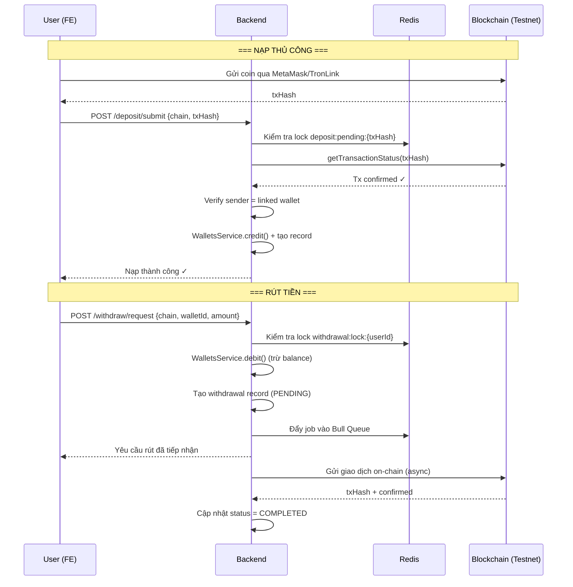

# Tích hợp Ví Đa Chuỗi (Tron + Solana + Sepolia ETH)

Sửa lại logic ví trên BE để hỗ trợ **Tron (Nile/Shasta testnet)**, **Solana (devnet)**, và **Ethereum Sepolia (MetaMask)**. User đăng ký **không bắt buộc nhập ví**, nhưng muốn giao dịch thì **phải liên kết ví** từ TronLink / Phantom / MetaMask.

## Cần User Xem Xét

> [!IMPORTANT]
> Bảng `wallets` (số dư nội bộ) **giữ nguyên** — vẫn là source of truth cho balance. Thêm bảng mới `linked_wallets` để lưu **địa chỉ ví on-chain** mà user đã xác minh quyền sở hữu.

> [!WARNING]
> **Cần chạy migration**: Tạo bảng `linked_wallets` mới. Không sửa đổi bảng cũ nào → không có rủi ro mất dữ liệu.

## Thay Đổi Đề Xuất

### Phần 1: Enum & Types mới

#### [MODIFY] [index.ts](file:///d:/Sources/cryptocurrency-trading-app/be-cryptocurrency-trading-app/src/common/enums/index.ts)

Thêm 2 enum:
```typescript
// Các mạng blockchain testnet được hỗ trợ
export enum BlockchainNetwork {
  TRON_NILE = 'TRON_NILE',         // Tron Nile testnet
  TRON_SHASTA = 'TRON_SHASTA',     // Tron Shasta testnet (TronScan)
  SOLANA_DEVNET = 'SOLANA_DEVNET', // Solana devnet
  ETH_SEPOLIA = 'ETH_SEPOLIA',     // Ethereum Sepolia (MetaMask)
}

// Trạng thái liên kết ví
export enum LinkedWalletStatus {
  PENDING = 'PENDING',     // Đang chờ xác minh chữ ký
  VERIFIED = 'VERIFIED',   // Đã xác minh → có thể giao dịch
  REVOKED = 'REVOKED',     // Đã huỷ liên kết
}
```

---

### Phần 2: Entity — LinkedWallet (bảng mới)

#### [NEW] [linked-wallet.entity.ts](file:///d:/Sources/cryptocurrency-trading-app/be-cryptocurrency-trading-app/src/entities/linked-wallet.entity.ts)

Bảng lưu ví on-chain mà user đã liên kết:

| Cột | Kiểu | Mô tả |
|-----|------|-------|
| `link_id` | `char(36)` PK | UUIDv7 |
| `user_id` | `char(36)` FK → users | Chủ sở hữu |
| `chain` | `enum(BlockchainNetwork)` | Mạng testnet nào |
| `address` | `varchar(255)` | Địa chỉ ví on-chain |
| `label` | `varchar(100)` nullable | Tên gợi nhớ |
| `status` | `enum(LinkedWalletStatus)` | PENDING → VERIFIED → REVOKED |
| `linked_at` | `datetime` nullable | Thời điểm xác minh thành công |
| `created_at` | `datetime` | Thời điểm tạo |

Ràng buộc unique: [(user_id, chain, address)](file:///d:/Sources/cryptocurrency-trading-app/be-cryptocurrency-trading-app/src/modules/exchange/interfaces/exchange.interface.ts#98-102) — 1 user không thể liên kết cùng 1 địa chỉ trên cùng 1 chain 2 lần.

---

### Phần 3: Blockchain Provider (Strategy Pattern)

Áp dụng **Strategy Pattern** giống cách đã làm với [IExchangeProvider](file:///d:/Sources/cryptocurrency-trading-app/be-cryptocurrency-trading-app/src/modules/exchange/interfaces/exchange.interface.ts#58-103) (Binance/Mock), nhưng cho blockchain.

#### [NEW] [blockchain.interface.ts](file:///d:/Sources/cryptocurrency-trading-app/be-cryptocurrency-trading-app/src/modules/blockchain/interfaces/blockchain.interface.ts)

Interface chung cho mọi chain:
```typescript
export interface IBlockchainProvider {
  getNetwork(): BlockchainNetwork;
  getBalance(address: string, tokenSymbol?: string): Promise<BlockchainBalanceDto>;
  verifySignature(address: string, message: string, signature: string): Promise<boolean>;
  getTransactionStatus(txHash: string): Promise<BlockchainTxStatusDto>;
  isValidAddress(address: string): boolean;
}
```

#### [NEW] [tron.provider.ts](file:///d:/Sources/cryptocurrency-trading-app/be-cryptocurrency-trading-app/src/modules/blockchain/providers/tron.provider.ts)

Dùng SDK `tronweb`, kết nối Nile/Shasta qua fullHost URL:
- [getBalance](file:///d:/Sources/cryptocurrency-trading-app/be-cryptocurrency-trading-app/src/modules/wallets/wallets.service.ts#97-114) → `tronWeb.trx.getBalance(address)` (trả về SUN → đổi sang TRX)
- `verifySignature` → `tronWeb.trx.verifyMessage(message, signature, address)`
- `getTransactionStatus` → `tronWeb.trx.getTransaction(txHash)`
- `isValidAddress` → `tronWeb.isAddress(address)`

#### [NEW] [solana.provider.ts](file:///d:/Sources/cryptocurrency-trading-app/be-cryptocurrency-trading-app/src/modules/blockchain/providers/solana.provider.ts)

Dùng SDK `@solana/web3.js`:
- [getBalance](file:///d:/Sources/cryptocurrency-trading-app/be-cryptocurrency-trading-app/src/modules/wallets/wallets.service.ts#97-114) → `connection.getBalance(publicKey)` (trả về lamport → đổi sang SOL)
- `verifySignature` → `nacl.sign.detached.verify(message, signature, publicKey)`
- `getTransactionStatus` → `connection.getTransaction(txHash)`
- `isValidAddress` → `PublicKey.isOnCurve(address)`

#### [NEW] [ethereum.provider.ts](file:///d:/Sources/cryptocurrency-trading-app/be-cryptocurrency-trading-app/src/modules/blockchain/providers/ethereum.provider.ts)

Dùng SDK `ethers` — tương thích MetaMask (EIP-191 personal_sign):
- [getBalance](file:///d:/Sources/cryptocurrency-trading-app/be-cryptocurrency-trading-app/src/modules/wallets/wallets.service.ts#97-114) → `provider.getBalance(address)` (trả về wei → đổi sang ETH)
- `verifySignature` → `ethers.verifyMessage(message, signature)` rồi so sánh address
- `getTransactionStatus` → `provider.getTransactionReceipt(txHash)`
- `isValidAddress` → `ethers.isAddress(address)`

#### [NEW] [blockchain-provider.factory.ts](file:///d:/Sources/cryptocurrency-trading-app/be-cryptocurrency-trading-app/src/modules/blockchain/blockchain-provider.factory.ts)

Factory class — nhận `BlockchainNetwork` enum, trả về provider tương ứng:
```typescript
@Injectable()
export class BlockchainProviderFactory {
  getProvider(network: BlockchainNetwork): IBlockchainProvider { ... }
}
```

#### [NEW] [blockchain.module.ts](file:///d:/Sources/cryptocurrency-trading-app/be-cryptocurrency-trading-app/src/modules/blockchain/blockchain.module.ts)

NestJS Module đăng ký tất cả provider + factory. Export `BlockchainProviderFactory`.

---

### Phần 4: Flow Liên Kết Ví (Challenge-Response)

Luồng hoạt động:
1. **Yêu cầu liên kết** → BE tạo nonce ngẫu nhiên → lưu Redis (TTL 5 phút) → trả về message cho FE
2. **Xác minh** → FE ký message bằng ví → gửi signature lên BE → BE verify bằng `IBlockchainProvider.verifySignature()` → nếu đúng → tạo `LinkedWallet` với status `VERIFIED`
3. **Huỷ liên kết** → đặt status = `REVOKED` (soft delete)
4. **Danh sách** → trả về ví đã liên kết (trừ REVOKED)

**Redis caching:**
- Nonce: `wallet:link:nonce:{userId}:{chain}:{address}` → TTL 300s
- Danh sách ví: `wallet:linked:{userId}` → TTL 600s, invalidate khi link/unlink

#### [NEW] [wallet-linking.service.ts](file:///d:/Sources/cryptocurrency-trading-app/be-cryptocurrency-trading-app/src/modules/blockchain/wallet-linking.service.ts)

Service xử lý toàn bộ logic liên kết ví.

#### [NEW] [wallet-linking.controller.ts](file:///d:/Sources/cryptocurrency-trading-app/be-cryptocurrency-trading-app/src/modules/blockchain/wallet-linking.controller.ts)

| Method | Đường dẫn | Mô tả |
|--------|-----------|-------|
| `POST` | `/blockchain/wallets/request-link` | Tạo nonce challenge |
| `POST` | `/blockchain/wallets/verify-link` | Xác minh chữ ký & tạo liên kết |
| `DELETE` | `/blockchain/wallets/:linkId` | Huỷ liên kết ví |
| `GET` | `/blockchain/wallets` | Danh sách ví đã liên kết |
| `GET` | `/blockchain/wallets/:linkId/balance` | Lấy số dư on-chain |

#### [NEW] DTOs (4 file trong `src/modules/blockchain/dto/`):
- `request-link.dto.ts` — `{ chain, address }`
- `verify-link.dto.ts` — `{ chain, address, signature }`
- `linked-wallet-response.dto.ts` — Response trả về
- `blockchain-balance.dto.ts` — Số dư on-chain

---

### Phần 5: Cấu hình (.env + Config)

#### [MODIFY] [app.config.ts](file:///d:/Sources/cryptocurrency-trading-app/be-cryptocurrency-trading-app/src/config/app.config.ts)

Thêm section `blockchain` vào [AppConfig](file:///d:/Sources/cryptocurrency-trading-app/be-cryptocurrency-trading-app/src/config/app.config.ts#9-87) interface + `setBlockchain()` vào Builder:
```typescript
blockchain: {
  tron: {
    nileFullHost: string;   // https://nile.trongrid.io
    shastaFullHost: string; // https://api.shasta.trongrid.io
    defaultNetwork: 'TRON_NILE' | 'TRON_SHASTA';
  };
  solana: {
    devnetUrl: string; // https://api.devnet.solana.com
  };
  ethereum: {
    sepoliaRpcUrl: string; // https://rpc.sepolia.org
    chainId: number;       // 11155111
  };
};
```

#### [MODIFY] [.env](file:///d:/Sources/cryptocurrency-trading-app/be-cryptocurrency-trading-app/.env) + [env.example](file:///d:/Sources/cryptocurrency-trading-app/be-cryptocurrency-trading-app/env.example)

```env
# Blockchain Testnet
TRON_NILE_FULL_HOST=https://nile.trongrid.io
TRON_SHASTA_FULL_HOST=https://api.shasta.trongrid.io
TRON_DEFAULT_NETWORK=TRON_NILE
SOLANA_DEVNET_URL=https://api.devnet.solana.com
ETH_SEPOLIA_RPC_URL=https://rpc.sepolia.org
ETH_SEPOLIA_CHAIN_ID=11155111
```

#### [MODIFY] [env.validation.ts](file:///d:/Sources/cryptocurrency-trading-app/be-cryptocurrency-trading-app/src/config/env.validation.ts)

Thêm validation cho các biến blockchain (optional, có default).

---

### Phần 6: Đăng ký Module

#### [MODIFY] [app.module.ts](file:///d:/Sources/cryptocurrency-trading-app/be-cryptocurrency-trading-app/src/app.module.ts)

Import `BlockchainModule` vào AppModule.

---

### Phần 7: Dependencies (NPM)

#### [MODIFY] [package.json](file:///d:/Sources/cryptocurrency-trading-app/be-cryptocurrency-trading-app/package.json)

Cài thêm:
- `tronweb` — SDK Tron cho Nile/Shasta
- `@solana/web3.js` — SDK Solana cho devnet
- `tweetnacl` — Xác minh chữ ký Solana
- `ethers` — SDK Ethereum cho Sepolia (MetaMask)

---

### Phần 8: Nạp / Rút / Chuyển Tiền On-chain

#### Phân tích vấn đề

Có 3 scenario chính cần xử lý:

| # | Scenario | Mô tả | Ai khởi xướng? |
|---|----------|-------|----------------|
| A | **Nạp tự động** | Platform phát hiện giao dịch đến ví deposit → cộng balance | Platform (polling) |
| B | **Nạp thủ công** | User gửi coin trên chain → submit txHash cho BE xác minh | User |
| C | **Rút tiền** | User yêu cầu rút → platform gửi coin từ hot wallet ra ví user | User yêu cầu, platform thực thi |
| D | **Chuyển cùng mạng** | User chuyển từ ví liên kết này sang ví liên kết khác cùng chain | User |

#### Giải pháp Best Practice

##### A. Nạp tiền tự động (Deposit Polling)

**Cách hoạt động:**
1. Mỗi chain có 1 **deposit address** dành riêng cho platform (hoặc mỗi user generate 1 address — tuỳ chiến lược)
2. Dùng **Bull Queue** (`@nestjs/bull`) tạo job chạy định kỳ (30s–60s) poll on-chain transactions
3. Job gọi `IBlockchainProvider.getTransactionStatus()` để kiểm tra giao dịch mới đến deposit address
4. Nếu phát hiện tx mới + đủ confirmations → tạo bản ghi `deposits` + gọi `WalletsService.credit()` cộng balance

**Redis hỗ trợ:**
- `deposit:lastBlock:{chain}` — lưu block cuối đã scan → tránh scan lại
- `deposit:processed:{chain}:{txHash}` — đánh dấu tx đã xử lý → idempotent

> [!NOTE]
> Ở giai đoạn testnet demo, dùng **phương án B (nạp thủ công)** là đủ. Polling tự động implement sau khi có nhu cầu production.

##### B. Nạp tiền thủ công (User Submit TxHash)

**Cách hoạt động — đây là phương án chính cho demo:**
1. User gửi coin trên chain (qua MetaMask/TronLink/Phantom) đến deposit address
2. User gọi API submit `{ chain, txHash, amount }`
3. BE verify on-chain: `IBlockchainProvider.getTransactionStatus(txHash)` → kiểm tra:
   - Tx có tồn tại & confirmed không?
   - Địa chỉ `from` có match ví liên kết của user không?
   - `amount` có khớp không?
   - TxHash chưa bị submit trước đó? (idempotent check trong `deposits` table)
4. Nếu hợp lệ → tạo `deposits` record + `WalletsService.credit()` cộng balance
5. Nếu không hợp lệ → trả lỗi rõ ràng (tx not found, wrong sender, already processed, ...)

**Redis hỗ trợ:**
- `deposit:pending:{txHash}` → TTL 10 phút, lock processing để tránh double-submit

##### C. Rút tiền (Withdrawal)

**Cách hoạt động:**
1. User gọi API `{ chain, linkedWalletId, amount }` — chỉ rút về ví đã liên kết & verified
2. BE kiểm tra:
   - Ví liên kết tồn tại & status = `VERIFIED`?
   - Balance đủ? → `WalletsService.debit()` trừ balance trước (freeze tiền)
   - Tạo `withdrawals` record với status `REQUESTED`
3. Đẩy job vào **Bull Queue** (`withdrawal-queue`) để xử lý async:
   - Job gọi `IBlockchainProvider` gửi giao dịch on-chain (từ platform hot wallet)
   - Cập nhật `withdrawals.tx_hash` + status `SENT`
   - Poll confirmation → status `COMPLETED`
4. Nếu gửi thất bại → status `FAILED` + hoàn trả balance (unfreeze)

> [!CAUTION]
> Rút tiền on-chain thật cần **platform hot wallet** với private key. Ở testnet demo, có thể mock phần gửi giao dịch và chỉ tạo record — hoặc dùng faucet wallet.

**Redis hỗ trợ:**
- `withdrawal:lock:{userId}:{chain}` → TTL 60s, chống spam rút liên tục
- `withdrawal:status:{withdrawId}` → cache trạng thái để FE poll nhanh

##### D. Chuyển tiền cùng mạng (Same-network Transfer)

**Cách hoạt động:**
1. User gọi API `{ fromLinkedWalletId, toAddress, chain, amount }`
2. BE kiểm tra:
   - `fromLinkedWalletId` thuộc user & verified?
   - `toAddress` hợp lệ trên chain đó? (`isValidAddress()`)
   - Balance nội bộ đủ?
3. Xử lý giống **Rút tiền** — debit balance + đẩy job queue gửi on-chain
4. Tạo ledger entry với `ref_type = 'TRANSFER'`

#### Entity mới cho giao dịch on-chain

#### [NEW] [onchain-transaction.entity.ts](file:///d:/Sources/cryptocurrency-trading-app/be-cryptocurrency-trading-app/src/entities/onchain-transaction.entity.ts)

Bảng theo dõi tất cả giao dịch on-chain (thay thế vai trò cụ thể hơn cho `deposits`/`withdrawals` hiện tại):

| Cột | Kiểu | Mô tả |
|-----|------|-------|
| `tx_id` | `char(36)` PK | UUIDv7 |
| `user_id` | `char(36)` FK | Chủ giao dịch |
| `linked_wallet_id` | `char(36)` FK nullable | Ví liên kết liên quan |
| `chain` | `enum(BlockchainNetwork)` | Mạng blockchain |
| `type` | `enum('DEPOSIT','WITHDRAWAL','TRANSFER')` | Loại giao dịch |
| `tx_hash` | `varchar(255)` nullable | Transaction hash on-chain |
| `from_address` | `varchar(255)` | Địa chỉ gửi |
| `to_address` | `varchar(255)` | Địa chỉ nhận |
| `amount` | `decimal(36,18)` | Số tiền |
| `confirmations` | `int` default 0 | Số block xác nhận |
| `status` | `enum('PENDING','CONFIRMING','COMPLETED','FAILED')` | Trạng thái |
| `created_at` | `datetime` | Thời điểm tạo |
| `confirmed_at` | `datetime` nullable | Thời điểm hoàn thành |

#### Service & Controller mới

#### [NEW] [onchain-transfer.service.ts](file:///d:/Sources/cryptocurrency-trading-app/be-cryptocurrency-trading-app/src/modules/blockchain/onchain-transfer.service.ts)

Xử lý logic nạp/rút/chuyển. Inject `BlockchainProviderFactory`, [WalletsService](file:///d:/Sources/cryptocurrency-trading-app/be-cryptocurrency-trading-app/src/modules/wallets/wallets.service.ts#23-648), `CacheService`.

#### [NEW] Endpoints bổ sung trong [wallet-linking.controller.ts](file:///d:/Sources/cryptocurrency-trading-app/be-cryptocurrency-trading-app/src/modules/blockchain/wallet-linking.controller.ts)

| Method | Đường dẫn | Mô tả |
|--------|-----------|-------|
| `POST` | `/blockchain/deposit/submit` | Nạp thủ công — submit txHash |
| `POST` | `/blockchain/withdraw/request` | Yêu cầu rút tiền |
| `GET` | `/blockchain/transactions` | Lịch sử giao dịch on-chain |
| `GET` | `/blockchain/transactions/:txId` | Chi tiết 1 giao dịch |

#### DTOs bổ sung:
- `submit-deposit.dto.ts` — `{ chain, txHash, amount }`
- `request-withdrawal.dto.ts` — `{ chain, linkedWalletId, amount }`
- `onchain-transaction-response.dto.ts` — Response giao dịch

#### Tóm tắt flow bằng sơ đồ



---

## Kế Hoạch Kiểm Tra

### Kiểm tra tự động
- `npm run build` phải pass không lỗi

### Kiểm tra thủ công (Swagger UI)
1. Chạy server: `npm run dev`
2. Mở `http://localhost:3000/docs`
3. Đăng ký user → xác nhận **không cần nhập thông tin ví**
4. Gọi `POST /blockchain/wallets/request-link` với `{ chain: "ETH_SEPOLIA", address: "0x..." }` → phải trả về nonce message
5. Gọi `GET /blockchain/wallets` → danh sách rỗng (chưa verify)
6. Gọi `POST /blockchain/deposit/submit` với txHash giả → phải trả lỗi "tx not found"
7. Gọi `POST /blockchain/withdraw/request` khi chưa có balance → phải trả lỗi "insufficient balance"
8. Gọi `GET /blockchain/transactions` → kiểm tra structure trả về đúng

> [!NOTE]
> Test end-to-end đầy đủ (ký chữ ký thật, gửi coin thật trên testnet) cần ví TronLink/Phantom/MetaMask + faucet. Ở giai đoạn demo, test flow bằng cách kiểm tra API response structure và Redis state.
